# Predictive ML Batch Monitoring with Amazon SageMaker AI

This folder contains notebook-based examples for monitoring predictive ML batch workloads with Amazon SageMaker AI, Evidently, and SageMaker managed MLflow.

The implementation is split into three notebooks so each monitoring concern is clear:

<<<<<<< ours
1. `predictive_ml_experimentation_data_model_monitoring_evidently.ipynb`
   - Interactive learning notebook.
   - Trains a sample model, runs batch inference, explores data drift, data quality, and model quality.
=======
- [Overview](#overview)
- [Solution Architecture](#solution-architecture)
- [Key Features](#key-features)
- [Prerequisites](#prerequisites)
- [Getting Started](#getting-started)
  - [Step 1: Experimentation and Learning](#step-1-experimentation-and-learning-notebook-1)
  - [Step 2: Pipeline Automation](#step-2-pipeline-automation-notebook-2)
  - [Step 3: Model Quality Automation](#step-3-model-quality-automation-notebook-3)
- [Monitoring Outputs](#monitoring-outputs)
- [Email Alerts](#email-alerts)
- [Viewing Results in MLflow](#viewing-results-in-mlflow)
- [Architecture Details](#architecture-details)
- [Cleanup](#cleanup)
- [Additional Resources](#additional-resources)
>>>>>>> theirs

2. `batch_monitoring_pipeline.ipynb`
   - Automation notebook for data drift and data quality only.
   - Creates a SageMaker Pipeline with one Processing step.
   - Does not run model quality, batch transform, or prediction evaluation.

3. `model_quality_monitoring_example.ipynb`
   - Separate model quality example.
   - Runs when predictions and ground truth labels are available.
   - Logs classification metrics and an Evidently model quality report to MLflow.

## Why Model Quality Is Separate

Data drift and data quality can be checked as soon as a new input data file arrives. Model quality needs predictions and ground truth labels, and ground truth often arrives later.

Keeping model quality out of the second automation solution makes the drift pipeline easier to reuse:

<<<<<<< ours
- The data drift pipeline only needs a baseline CSV and a current CSV.
- The model quality pipeline only runs when labels are ready.
- Customers can schedule the two workflows independently.
- Failures in delayed-label processing do not block daily data drift checks.
=======
An optional third notebook adds a separate automated model quality pipeline for cases where predictions and ground truth labels are available on their own schedule.

---
>>>>>>> theirs

## Recommended Input File Pattern

<<<<<<< ours
The recommended pattern is to pass explicit S3 file locations into the monitoring processing job:
=======
### End-to-End Monitoring Workflow

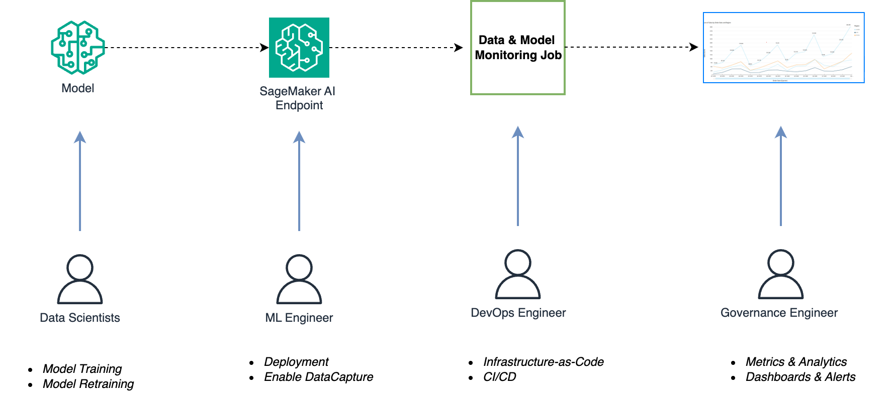

The complete workflow includes:
1. **Batch Inference**: Process production data using SageMaker Batch Transform
2. **Data Drift Detection**: Compare current data against baseline using Evidently AI
3. **Model Quality Tracking**: Evaluate classification performance metrics
4. **MLflow Integration**: Log all metrics, parameters, and artifacts
5. **Alerting**: Send SNS notifications when drift is detected
6. **Scheduling**: Automate monitoring runs with EventBridge

### Automated Pipeline Architecture

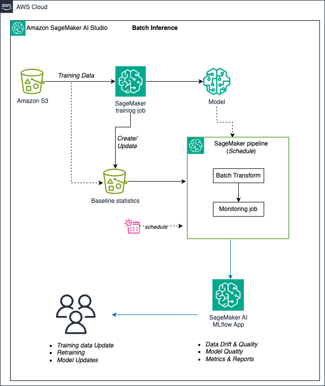

The automated pipeline consists of:
- **EventBridge Scheduler**: Triggers pipeline execution on a recurring schedule
- **SageMaker Pipeline**: Orchestrates the monitoring workflow
- **Batch Transform Step**: Generates predictions on production data
- **Processing Step**: Runs Evidently drift detection and logs to MLflow
- **SNS Notifications**: Sends email alerts when drift thresholds are exceeded

### Alerting Architecture

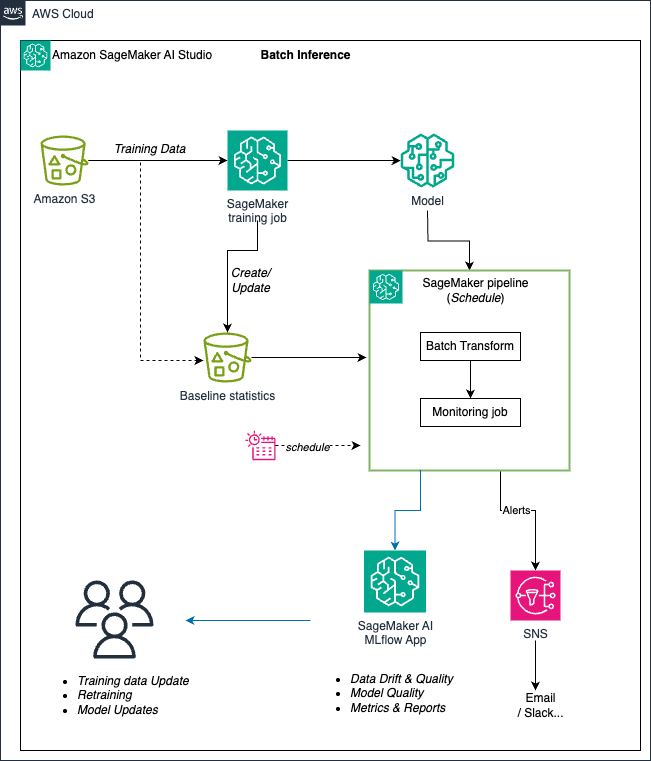

The alerting mechanism provides:
- **Drift Threshold Detection**: Monitors configurable drift thresholds
- **SNS Topic Integration**: Publishes alerts to Amazon SNS
- **Email Subscriptions**: Delivers notifications to stakeholders
- **Custom Alert Payloads**: Includes drift details and affected features

---

## Key Features

| Feature | Description | Benefit |
|---------|-------------|---------|
| **Data Drift Detection** | Statistical comparison of current vs. baseline data distributions using Evidently AI | Catch data quality issues before they impact model performance |
| **Model Quality Tracking** | Binary classification metrics (Accuracy, Precision, Recall, F1, AUC) | Monitor model performance degradation over time |
| **MLflow Integration** | Unified experiment tracking for training and monitoring runs | Complete model lineage and reproducibility |
| **Automated Alerting** | SNS email notifications when drift exceeds thresholds | Proactive incident response |
| **Scheduled Execution** | EventBridge rules for daily/weekly/monthly monitoring | Hands-free continuous monitoring |
| **Interactive Reports** | HTML reports with visualizations and detailed analysis | Easy exploration and root cause analysis |
| **SageMaker Pipelines** | Managed workflow orchestration with parameter overrides | Scalable, production-ready automation |
| **Batch Transform** | Cost-effective inference without always-on endpoints | Optimized for periodic batch predictions |

---

## Prerequisites

### AWS Resources
- **Amazon SageMaker Studio** with JupyterLab
- **SageMaker AI MLflow App** (DefaultMLFlowApp or custom)
- **S3 Bucket** for data and artifacts
- **IAM Role** with SageMaker, S3, SNS, and MLflow permissions

### Python Environment
- Python 3.10+
- SageMaker Python SDK v3
- MLflow 3.4.0
- Evidently AI 0.7.20+

### Domain Knowledge
- Basic understanding of ML model training and evaluation
- Familiarity with AWS services (SageMaker, S3, SNS, EventBridge)
- Experience with Jupyter notebooks

---

## Getting Started

This solution keeps the two existing notebooks in sequence and adds a third notebook for automated model quality monitoring:

---

## Step 1: Experimentation and Learning (Notebook 1)

**Notebook:** `predictive_ml_experimentation_data_model_monitoring_evidently.ipynb`

### Purpose
Learn the fundamentals of ML monitoring by interactively running each component of the monitoring workflow. This notebook is designed for **experimentation and education**.

### What You'll Learn
1. How to train an XGBoost model on SageMaker with MLflow tracking
2. How to run batch inference using SageMaker Batch Transform
3. How to detect data drift using Evidently AI
4. How to evaluate binary classification performance
5. How to log metrics and artifacts to MLflow
6. How monitoring reports are generated and interpreted

### Workflow

#### 1. Setup and Configuration
```python
# The notebook automatically configures:
# - SageMaker session and IAM role
# - MLflow tracking URI pointing to your MLflow App
# - S3 paths for data and artifacts
```

#### 2. Train Model with MLflow Tracking
- Downloads bank marketing dataset from UCI repository
- Trains XGBoost binary classification model
- Logs parameters, metrics, and model artifacts to MLflow
- Registers model in SageMaker Model Registry

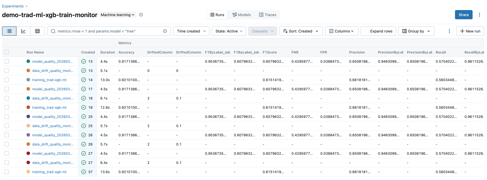

#### 3. Run Batch Transform for Inference
- Deploys model using SageMaker Batch Transform
- Generates predictions on test dataset
- Saves predictions to S3 for downstream monitoring

#### 4. Data Drift Detection with Evidently
- Loads baseline (training) and current (production) data
- Runs Evidently `DataDriftPreset` to detect distribution changes
- Generates interactive HTML report with drift visualizations
- Logs drift metrics to MLflow

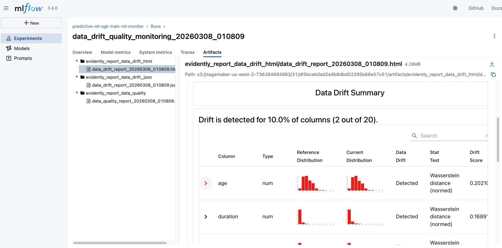

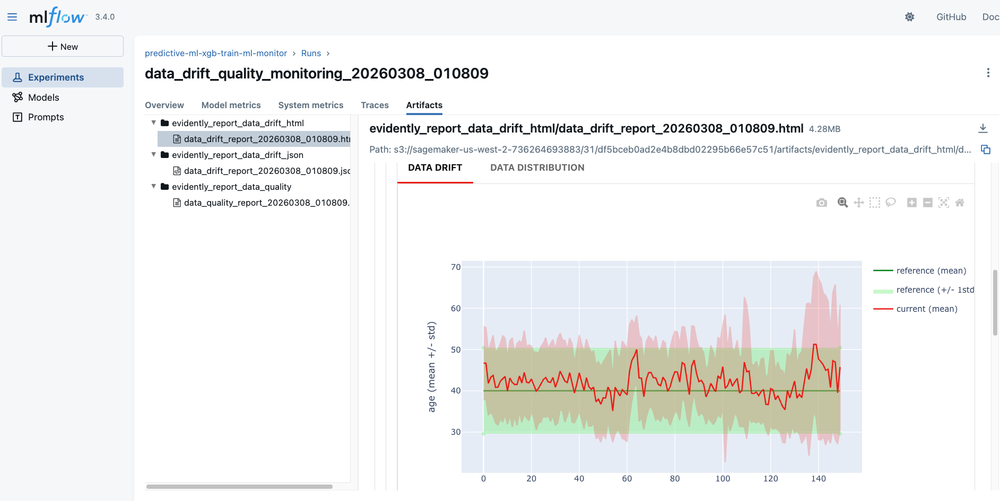

#### 5. Model Quality Evaluation
- Evaluates classification performance on test set
- Computes Accuracy, Precision, Recall, F1 Score, ROC-AUC
- Generates confusion matrix and classification report
- Logs all metrics to MLflow

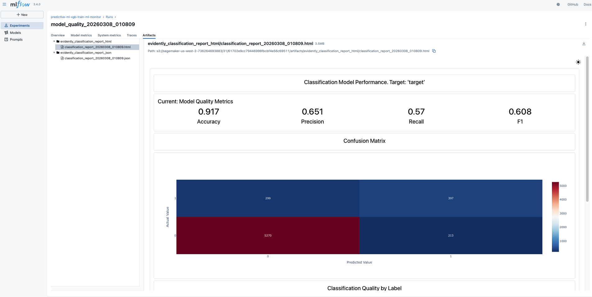

#### 6. Data Quality Assessment
- Runs Evidently `DataSummaryPreset` for data quality checks
- Identifies missing values, outliers, and data integrity issues
- Logs quality metrics to MLflow

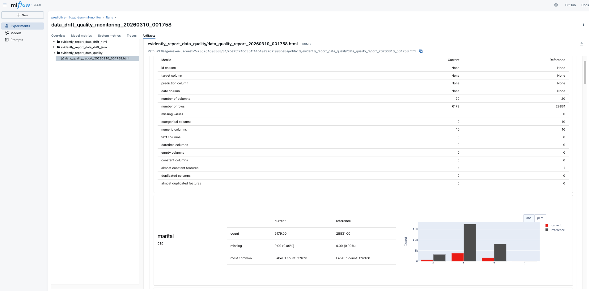

### Key Outputs

| Output | Location | Description |
|--------|----------|-------------|
| Trained Model | MLflow Artifacts | XGBoost model with training metadata |
| Predictions | S3 + Local CSV | Batch inference outputs |
| Drift Report | MLflow Artifacts | HTML/JSON drift analysis |
| Quality Report | MLflow Artifacts | HTML data quality assessment |
| Metrics | MLflow Runs | All drift and model metrics |

### Viewing Results

Navigate to **SageMaker Studio → MLflow Panel → Experiments**:

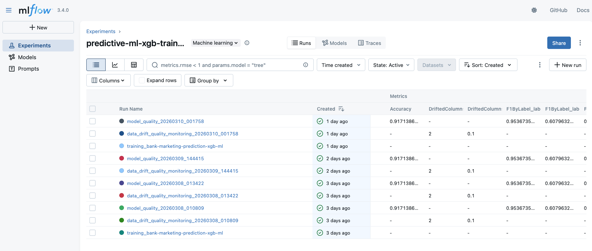

You'll see multiple runs:
- **Training runs** with model metrics (Accuracy, F1, AUC)
- **Monitoring runs** with drift metrics (DriftedColumnsCount, ValueDrift per feature)
- **Quality runs** with data quality metrics

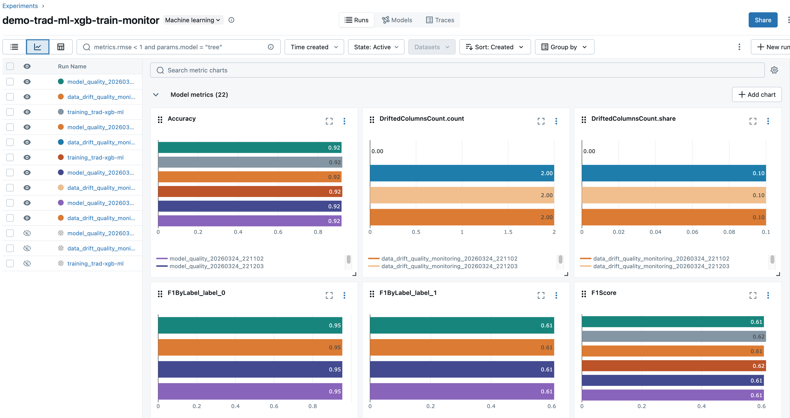

### Time to Complete
Approximately **15-20 minutes** for full execution.

---

## Step 2: Pipeline Automation (Notebook 2)

**Notebook:** `batch_monitoring_pipeline.ipynb`

### Purpose
Operationalize the monitoring workflow into an **automated SageMaker Pipeline** that runs on a schedule without manual intervention.

### What You'll Build
1. A SageMaker Pipeline with a Processing step for data drift and data quality
2. A Python processing script that runs Evidently data monitoring
3. An SNS topic for drift alert notifications
4. An EventBridge schedule rule for automated execution
5. MLflow integration using the **same tracking server** as Notebook 1

### Architecture

The pipeline automates the workflow from Notebook 1:

| Notebook 1 Section | Pipeline Component |
|-------------------|-------------------|
| Section 6: Data Drift Monitoring | **ProcessingStep** - Runs Evidently DataDriftPreset |
| Section 8: Data Quality | **ProcessingStep** - Runs Evidently DataSummaryPreset |
| MLflow Logging | **Processing Script** - Logs to same MLflow App |

### Workflow

#### 1. Configuration
Update the configuration in **Section 2** of the notebook:

```python
# S3 paths for your data
baseline_s3_uri = 's3://your-bucket/data/baseline/'  # Reference data
production_s3_uri = 's3://your-bucket/data/production/'  # Current data

# MLflow configuration (uses same app as Notebook 1)
mlflow_app_name = 'DefaultMLFlowApp'  # SAME AS NOTEBOOK 1
mlflow_experiment_name = 'test-monitor-pipeline'  # SAME AS NOTEBOOK 1

# Email for drift alerts
notification_email = 'your-email@example.com'

# Schedule (daily, hourly, weekly, etc.)
schedule_expression = 'rate(1 day)'
```

#### 2. Create SNS Topic for Alerts
The notebook creates an SNS topic and email subscription:

```python
sns_topic_arn = 'arn:aws:sns:region:account:pipeline-drift-alerts'
```

**IMPORTANT:** Check your email and confirm the SNS subscription!

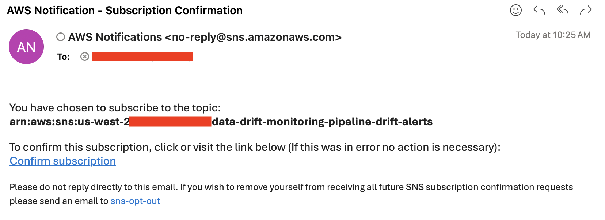

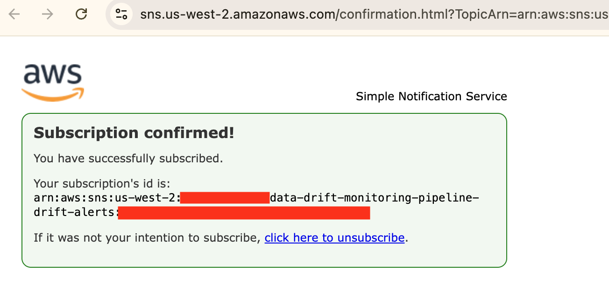

#### 3. Create Monitoring Script
The pipeline uses `scripts/monitoring_processor.py` which:
- Downloads latest CSV files from baseline and production S3 paths
- Runs Evidently drift detection and quality checks
- Logs all metrics to MLflow (same experiment as Notebook 1)
- Sends SNS alert if drift exceeds threshold
- Saves HTML/JSON reports to S3

#### 4. Build SageMaker Pipeline
The notebook creates a pipeline with:
- **Parameters**: BaselineS3Uri, ProductionS3Uri (overridable at runtime)
- **ProcessingStep**: Evidently monitoring with MLflow logging
- **Outputs**: Monitoring reports saved to S3

#### 5. Test Pipeline Execution
Run a test execution to verify everything works:

```python
execution = monitoring_pipeline.start()
execution.wait()
```

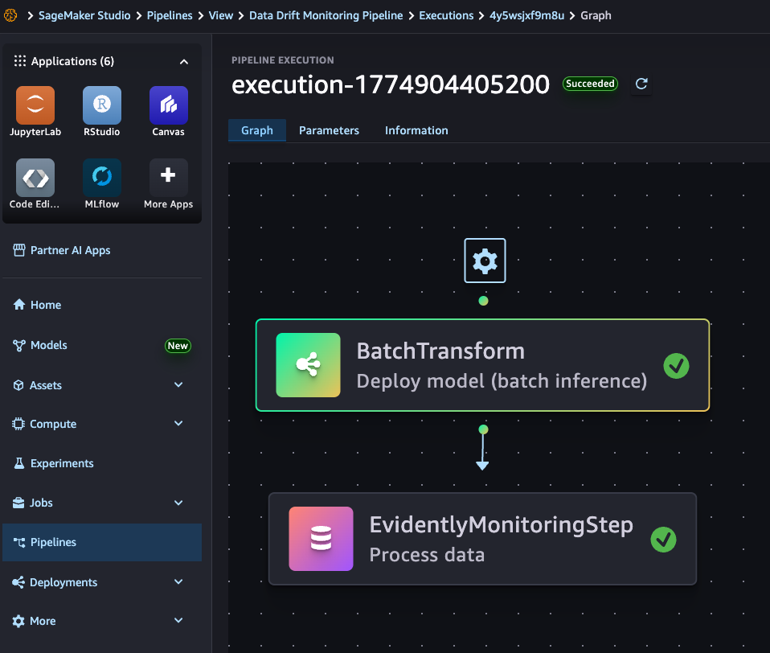

#### 6. Schedule with EventBridge
The notebook creates an EventBridge rule that triggers the pipeline automatically:
>>>>>>> theirs

```python
baseline_data_s3_uri = "s3://my-bucket/monitoring/baseline/baseline.csv"
current_data_s3_uri = "s3://my-bucket/monitoring/current/2026-04-18.csv"
```

This is usually better for customer plug-and-play than relying only on "latest file" pickup because the caller controls exactly which file is monitored.

The data drift processor still supports latest-file pickup for simple scheduled demos:

```python
use_latest_file_pickup = "true"
baseline_data_s3_uri = "s3://my-bucket/monitoring/baseline/"
current_data_s3_uri = "s3://my-bucket/monitoring/current/"
```

<<<<<<< ours
When `use_latest_file_pickup` is true, the processor searches each prefix and selects the newest CSV by S3 `LastModified` time.
=======
This ensures:
- All training and monitoring runs appear in the same experiment
- You can compare drift metrics across time
- Model lineage is maintained from training to monitoring

### Time to Complete
- **Initial setup:** 10-15 minutes
- **Each automated run:** 5-10 minutes (no manual intervention)

---

## Step 3: Model Quality Automation (Notebook 3)

**Notebook:** `model_quality_monitoring_example.ipynb`

### Purpose
Run model quality monitoring as a separate automated workflow when predictions and ground truth labels are available. This keeps Notebook 1 as the experimentation notebook and keeps Notebook 2 focused on data drift and data quality.

### What You'll Build
1. A SageMaker Pipeline with one Processing step for model quality
2. A Python processing script that compares predictions with labels
3. Evidently `ClassificationPreset` reports logged to MLflow
4. An optional EventBridge schedule for recurring model quality checks

### Required Inputs

```python
predictions_s3_uri = 's3://your-bucket/model-quality/predictions.csv'
ground_truth_s3_uri = 's3://your-bucket/model-quality/ground_truth.csv'
```

The predictions CSV must include a predicted label column. It can also include a probability column for ROC-AUC. The ground truth CSV must include the true label column. For this simple example, rows must line up between both files.

---

## Monitoring Outputs

### Metrics Tracked in MLflow

| Metric Type | Metrics | Description |
|------------|---------|-------------|
| **Data Drift** | `DriftedColumnsCount.count`, `DriftedColumnsCount.share` | Number and percentage of features with drift |
| **Feature Drift** | `ValueDrift:feature_name` | Per-feature drift scores (only if exceeds threshold) |
| **Model Quality** | `Accuracy`, `Precision`, `Recall`, `F1Score`, `ROC-AUC` | Classification performance metrics |
| **Confusion Matrix** | `TruePositives`, `TrueNegatives`, `FalsePositives`, `FalseNegatives` | Prediction breakdown |

### Metric Visualizations

Track model performance over time:
>>>>>>> theirs

Use explicit file paths when:

- Several files can land in the same prefix close together.
- An upstream pipeline already knows the exact file to monitor.
- You need auditability and reproducibility for each monitoring run.

Use latest-file pickup when:

- You are building a simple demo.
- A landing prefix contains only one new file per schedule interval.
- You accept the risk that object arrival order controls the selected file.

## Files

| Path | Purpose |
|---|---|
| `batch_monitoring_pipeline.ipynb` | Builds the automated data drift and data quality SageMaker Pipeline |
| `model_quality_monitoring_example.ipynb` | Builds the optional model quality SageMaker Pipeline |
| `predictive_ml_experimentation_data_model_monitoring_evidently.ipynb` | Interactive experimentation notebook |
| `scripts/monitoring_processor.py` | Processing script for data drift and data quality only |
| `scripts/model_quality_processor.py` | Processing script for binary classification model quality |
| `scripts/requirements.txt` | Python package list used by the examples |

## Notebook 2: Data Drift and Data Quality Automation

`batch_monitoring_pipeline.ipynb` creates:

- A SageMaker Pipeline named `data-drift-quality-monitoring-pipeline`
- One SageMaker Processing step named `DataDriftAndQualityMonitoring`
- An optional SNS topic for drift alerts
- An optional EventBridge Scheduler schedule
- MLflow runs containing metrics, parameters, and Evidently report artifacts

The processing script expects:

- Baseline CSV with headers
- Current CSV with the same headers, in the same column order

It logs:

- `DriftedColumnsCount.count`
- `DriftedColumnsCount.share`
- `ValueDrift:<feature>` for features that cross the drift threshold
- baseline and current row counts
- baseline and current missing-cell counts
- baseline and current duplicate-row counts
- Evidently data drift HTML and JSON reports
- Evidently data quality HTML and JSON reports
- `monitoring_summary.json`

## Notebook 3: Model Quality Example

`model_quality_monitoring_example.ipynb` creates:

- A SageMaker Pipeline named `model-quality-monitoring-pipeline`
- One SageMaker Processing step named `ModelQualityMonitoring`
- MLflow runs containing classification metrics and Evidently model quality artifacts

The model quality processor expects:

- Predictions CSV with a `prediction` column
- Optional prediction probability column named `prediction_proba`
- Ground truth CSV with a `target` column

The rows must line up. Row 1 in the predictions file must refer to the same record as row 1 in the ground truth file. In production, join predictions and labels by a stable record ID before running model quality.

It logs:

- `Accuracy`
- `Precision`
- `Recall`
- `F1Score`
- `ROC_AUC` when a probability column is available
- Evidently model quality HTML and JSON reports
- `model_quality_summary.json`

## Prerequisites

- Amazon SageMaker Studio or a notebook environment with AWS credentials
- SageMaker execution role with access to SageMaker, S3, SNS, IAM, EventBridge Scheduler, and SageMaker managed MLflow
- SageMaker managed MLflow app, for example `DefaultMLFlowApp`
- S3 bucket for input CSV files and monitoring artifacts
- Python 3.10 or later

The notebooks install the Python packages they need. The processing scripts install runtime packages inside the SageMaker Processing container so the sample can run without a custom image.

For production, use a custom processing image with pinned dependency versions. That avoids runtime package installation and makes processing jobs start faster.

## Basic Workflow

1. Run the experimentation notebook if you want to generate demo model artifacts and local sample files.
2. Upload or point Notebook 2 at a baseline CSV and current CSV.
3. Run Notebook 2 to create and test the data drift and data quality pipeline.
4. Optionally create the EventBridge schedule in Notebook 2.
5. When predictions and ground truth labels are available, point Notebook 3 at those files.
6. Run Notebook 3 to create and test the model quality pipeline.
7. Review all runs and artifacts in the configured SageMaker managed MLflow experiment.

## Cleanup

<<<<<<< ours
Each automation notebook includes cleanup cells for resources it creates.
=======
### Remove Notebook 1 Resources

```python
# In predictive_ml_experimentation_data_model_monitoring_evidently.ipynb
# Run the cleanup section (Section 10)

# Delete SageMaker model
sm_client.delete_model(ModelName=model_name)

# Note: MLflow runs and S3 data are preserved for audit
```

### Remove Notebook 2 Resources

```python
# In batch_monitoring_pipeline.ipynb
# Run the cleanup section (Section 10)

# This will remove:
# - EventBridge scheduled rule
# - SageMaker Pipeline
# - SNS topic and subscriptions
# - IAM roles for EventBridge

# MLflow runs and S3 data are preserved
```

### Complete Cleanup (Optional)

To remove all traces:

```bash
# Delete S3 data
aws s3 rm s3://your-bucket/monitoring-pipeline/ --recursive

# Delete MLflow experiment (from MLflow UI or API)
# Note: This is usually NOT recommended as it removes historical data
```

---

## Additional Resources

### Documentation
- [SageMaker Python SDK v3](https://sagemaker.readthedocs.io/en/stable/)
- [SageMaker AI MLflow](https://docs.aws.amazon.com/sagemaker/latest/dg/mlflow.html)
- [SageMaker Pipelines](https://docs.aws.amazon.com/sagemaker/latest/dg/pipelines.html)
- [Evidently AI Documentation](https://docs.evidentlyai.com/)
- [SageMaker Batch Transform](https://docs.aws.amazon.com/sagemaker/latest/dg/batch-transform.html)

### GitHub Repositories
- [Evidently AI GitHub](https://github.com/evidentlyai/evidently)
- [SageMaker Examples](https://github.com/aws/amazon-sagemaker-examples)
- [MLflow Documentation](https://mlflow.org/docs/latest/index.html)

### Related Solutions
- [Real-Time Inference Monitoring](images/arch-sagemaker-inference-predictiveml-monitoring-RealTime-inf.png)
- [Real-Time with Athena Integration](images/arch-sagemaker-inference-predictiveml-monitoring-RealTime-inf-Athena.png)
- [LLM Monitoring Solution](images/arch-sagemaker-inference-llm-monitoring-solution.png)
- [Multi-Account LLM Monitoring](images/arch-sagemaker-inference-llm-monitoring-multi-acc-arch.png)

### Schedule Expression Examples

| Use Case | Expression | Description |
|----------|-----------|-------------|
| Daily at midnight | `rate(1 day)` | Every 24 hours |
| Every 6 hours | `rate(6 hours)` | Four times per day |
| Every Monday at 8 AM | `cron(0 8 ? * MON *)` | Weekly |
| 1st of each month | `cron(0 8 1 * ? *)` | Monthly |
| Every weekday at 9 AM | `cron(0 9 ? * MON-FRI *)` | Business days only |

For more schedule expressions, see [EventBridge Schedule Expressions](https://docs.aws.amazon.com/eventbridge/latest/userguide/eb-create-rule-schedule.html).

---

## Summary

This solution provides a complete, production-ready ML monitoring system with:

✅ **Interactive Learning** (Notebook 1) - Understand monitoring fundamentals  
✅ **Automated Operations** (Notebook 2) - Production-ready pipeline  
✅ **Model Quality Automation** (Notebook 3) - Separate pipeline for predictions and labels  
✅ **Unified Tracking** - Single MLflow experiment for all runs  
✅ **Proactive Alerts** - Email notifications on drift detection  
✅ **Scalable Architecture** - Handles large datasets with batch processing  
✅ **Cost Optimized** - No always-on inference endpoints  
✅ **Enterprise Ready** - Multi-account, governance, and audit support  
>>>>>>> theirs

Notebook 2 cleanup removes:

- EventBridge Scheduler schedule
- SageMaker Pipeline
- SNS topic
- Scheduler IAM role

Notebook 3 cleanup removes:

- SageMaker Pipeline

MLflow runs and S3 artifacts are intentionally preserved unless you delete them separately.
