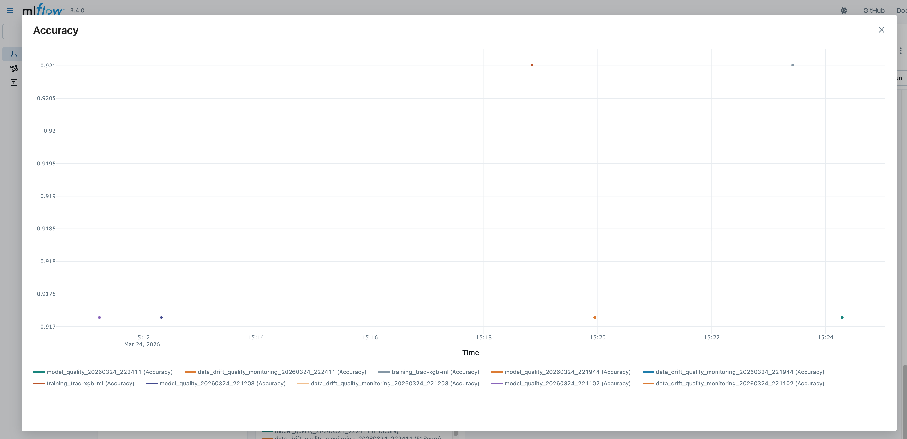
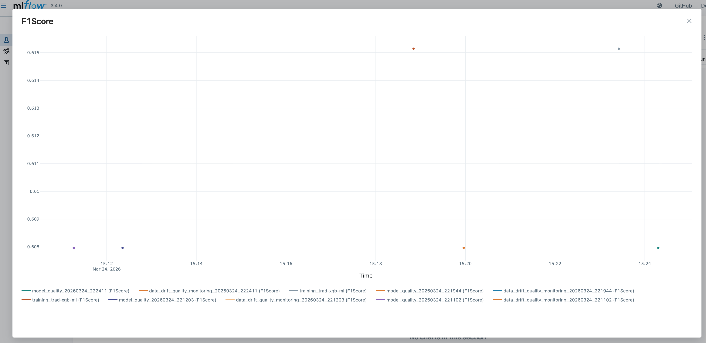
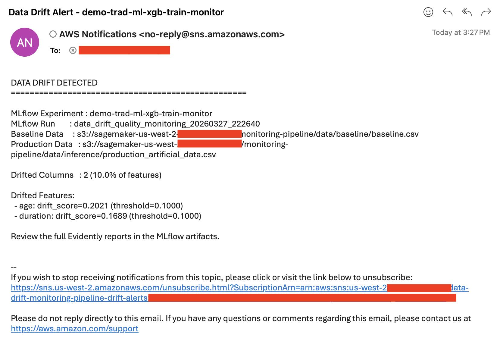
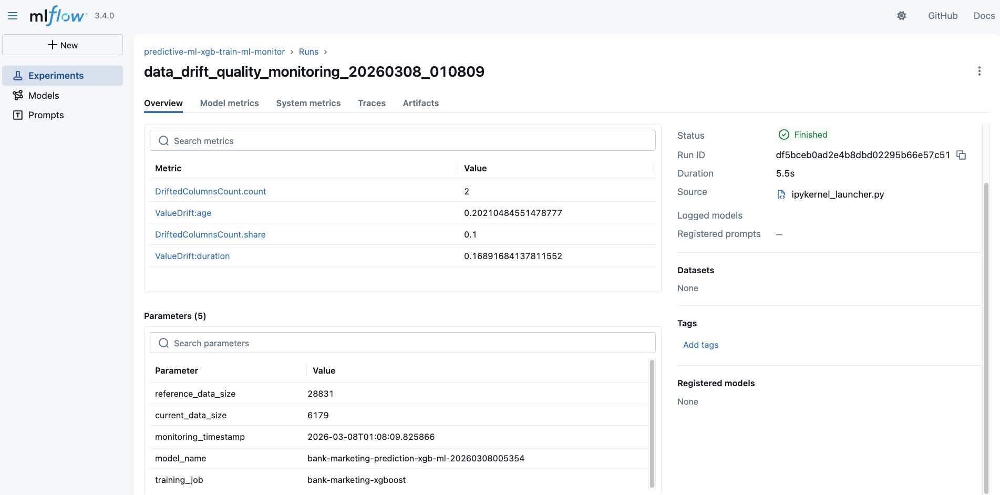
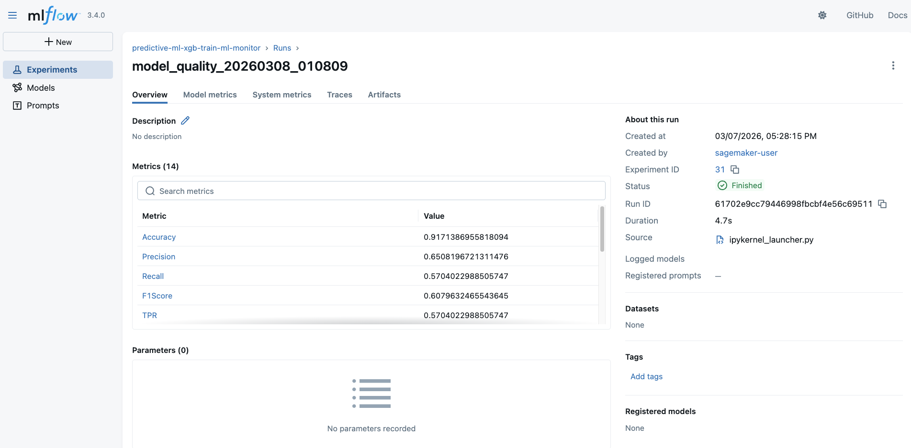
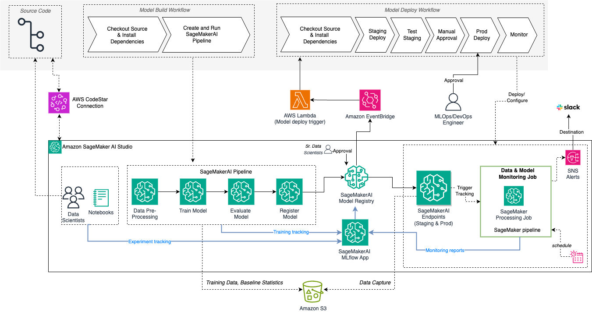
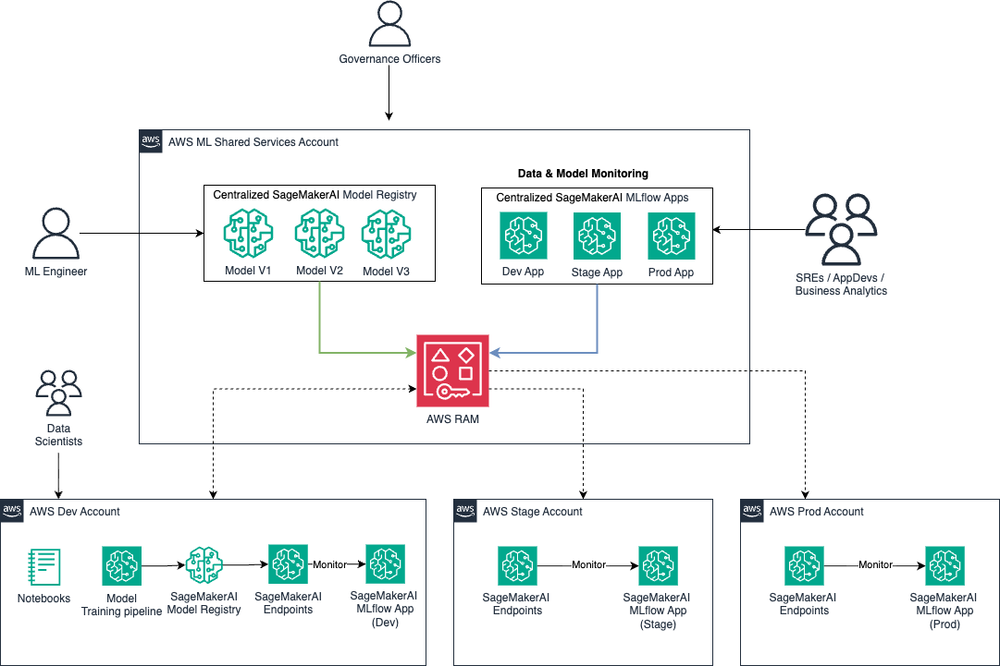

# Predictive ML Batch Monitoring Pipeline with Amazon SageMaker AI

A comprehensive solution for **automated ML model monitoring** on Amazon SageMaker AI that demonstrates data drift detection, model quality tracking, and automated alerting using **SageMaker Pipelines**, **Evidently AI**, and **MLflow**. The OSS version of [Evidently AI](https://docs.evidentlyai.com/introduction) is comsumed in this monitoring solution to extend the metrics.

## Table of Contents

- [Overview](#overview)
- [Solution Architecture](#solution-architecture)
- [Key Features](#key-features)
- [Prerequisites](#prerequisites)
- [Getting Started](#getting-started)
  - [Step 1: Experimentation and Learning](#step-1-experimentation-and-learning-notebook-1)
  - [Step 2: Pipeline Automation](#step-2-pipeline-automation-notebook-2)
- [Monitoring Outputs](#monitoring-outputs)
- [Email Alerts](#email-alerts)
- [Viewing Results in MLflow](#viewing-results-in-mlflow)
- [Architecture Details](#architecture-details)
- [Cleanup](#cleanup)
- [Additional Resources](#additional-resources)

---

## Overview

This solution provides a **two-phase approach** to implementing ML monitoring on Amazon SageMakerAI:

### Phase 1: Experimentation (Notebook 1)
Learn the fundamentals of ML monitoring by interactively exploring data drift detection, model quality evaluation, and MLflow experiment tracking.

### Phase 2: Automation (Notebook 2)
Operationalize the monitoring workflow with an automated SageMakerAI Pipeline that runs on a schedule, sends alerts, and tracks all metrics in MLflow.

---

## Solution Architecture

### End-to-End Monitoring Workflow


The complete workflow includes:
1. **Batch Inference**: Process production data using SageMaker Batch Transform
2. **Data Drift Detection**: Compare current data against baseline using Evidently AI
3. **Model Quality Tracking**: Evaluate classification performance metrics
4. **MLflow Integration**: Log all metrics, parameters, and artifacts
5. **Alerting**: Send SNS notifications when drift is detected
6. **Scheduling**: Automate monitoring runs with EventBridge

### Automated Pipeline Architecture


The automated pipeline consists of:
- **EventBridge Scheduler**: Triggers pipeline execution on a recurring schedule
- **SageMaker Pipeline**: Orchestrates the monitoring workflow
- **Batch Transform Step**: Generates predictions on production data
- **Processing Step**: Runs Evidently drift detection and logs to MLflow
- **SNS Notifications**: Sends email alerts when drift thresholds are exceeded

### Alerting Architecture


The alerting mechanism provides:
- **Drift Threshold Detection**: Monitors configurable drift thresholds
- **SNS Topic Integration**: Publishes alerts to Amazon SNS
- **Email Subscriptions**: Delivers notifications to stakeholders
- **Custom Alert Payloads**: Includes drift details and affected features

---

## Key Features

| Feature | Description | Benefit |
|---------|-------------|---------|
| **Data Drift Detection** | Statistical comparison of current vs. baseline data distributions using Evidently AI | Catch data quality issues before they impact model performance |
| **Model Quality Tracking** | Binary classification metrics (Accuracy, Precision, Recall, F1, AUC) | Monitor model performance degradation over time |
| **MLflow Integration** | Unified experiment tracking for training and monitoring runs | Complete model lineage and reproducibility |
| **Automated Alerting** | SNS email notifications when drift exceeds thresholds | Proactive incident response |
| **Scheduled Execution** | EventBridge rules for daily/weekly/monthly monitoring | Hands-free continuous monitoring |
| **Interactive Reports** | HTML reports with visualizations and detailed analysis | Easy exploration and root cause analysis |
| **SageMaker Pipelines** | Managed workflow orchestration with parameter overrides | Scalable, production-ready automation |
| **Batch Transform** | Cost-effective inference without always-on endpoints | Optimized for periodic batch predictions |

---

## Prerequisites

### AWS Resources
- **Amazon SageMaker Studio** with JupyterLab
- **SageMaker AI MLflow App** (DefaultMLFlowApp or custom)
- **S3 Bucket** for data and artifacts
- **IAM Role** with SageMaker, S3, SNS, and MLflow permissions

### Python Environment
- Python 3.10+
- SageMaker Python SDK v3
- MLflow 3.4.0
- Evidently AI 0.7.20+

### Domain Knowledge
- Basic understanding of ML model training and evaluation
- Familiarity with AWS services (SageMaker, S3, SNS, EventBridge)
- Experience with Jupyter notebooks

---

## Getting Started

This solution consists of **two notebooks** that should be executed in sequence:

---

## Step 1: Experimentation and Learning (Notebook 1)

**Notebook:** `predictive_ml_experimentation_data_model_monitoring_evidently.ipynb`

### Purpose
Learn the fundamentals of ML monitoring by interactively running each component of the monitoring workflow. This notebook is designed for **experimentation and education**.

### What You'll Learn
1. How to train an XGBoost model on SageMaker with MLflow tracking
2. How to run batch inference using SageMaker Batch Transform
3. How to detect data drift using Evidently AI
4. How to evaluate binary classification performance
5. How to log metrics and artifacts to MLflow
6. How monitoring reports are generated and interpreted

### Workflow

#### 1. Setup and Configuration
```python
# The notebook automatically configures:
# - SageMaker session and IAM role
# - MLflow tracking URI pointing to your MLflow App
# - S3 paths for data and artifacts
```

#### 2. Train Model with MLflow Tracking
- Downloads bank marketing dataset from UCI repository
- Trains XGBoost binary classification model
- Logs parameters, metrics, and model artifacts to MLflow
- Registers model in SageMaker Model Registry


#### 3. Run Batch Transform for Inference
- Deploys model using SageMaker Batch Transform
- Generates predictions on test dataset
- Saves predictions to S3 for downstream monitoring

#### 4. Data Drift Detection with Evidently
- Loads baseline (training) and current (production) data
- Runs Evidently `DataDriftPreset` to detect distribution changes
- Generates interactive HTML report with drift visualizations
- Logs drift metrics to MLflow


#### 5. Model Quality Evaluation
- Evaluates classification performance on test set
- Computes Accuracy, Precision, Recall, F1 Score, ROC-AUC
- Generates confusion matrix and classification report
- Logs all metrics to MLflow


#### 6. Data Quality Assessment
- Runs Evidently `DataSummaryPreset` for data quality checks
- Identifies missing values, outliers, and data integrity issues
- Logs quality metrics to MLflow


### Key Outputs

| Output | Location | Description |
|--------|----------|-------------|
| Trained Model | MLflow Artifacts | XGBoost model with training metadata |
| Predictions | S3 + Local CSV | Batch inference outputs |
| Drift Report | MLflow Artifacts | HTML/JSON drift analysis |
| Quality Report | MLflow Artifacts | HTML data quality assessment |
| Metrics | MLflow Runs | All drift and model metrics |

### Viewing Results

Navigate to **SageMaker Studio → MLflow Panel → Experiments**:


You'll see multiple runs:
- **Training runs** with model metrics (Accuracy, F1, AUC)
- **Monitoring runs** with drift metrics (DriftedColumnsCount, ValueDrift per feature)
- **Quality runs** with data quality metrics


### Time to Complete
Approximately **15-20 minutes** for full execution.

---

## Step 2: Pipeline Automation (Notebook 2)

**Notebook:** `batch_monitoring_pipeline.ipynb`

### Purpose
Operationalize the monitoring workflow into an **automated SageMaker Pipeline** that runs on a schedule without manual intervention.

### What You'll Build
1. A SageMaker Pipeline with Batch Transform and Processing steps
2. A Python processing script that runs Evidently monitoring
3. An SNS topic for drift alert notifications
4. An EventBridge schedule rule for automated execution
5. MLflow integration using the **same tracking server** as Notebook 1

### Architecture

The pipeline automates the workflow from Notebook 1:

| Notebook 1 Section | Pipeline Component |
|-------------------|-------------------|
| Section 4: Batch Transform | **TransformStep** - Generates predictions |
| Section 6: Data Drift Monitoring | **ProcessingStep** - Runs Evidently DataDriftPreset |
| Section 7: Model Quality Evaluation | **ProcessingStep** - Runs Evidently ClassificationPreset |
| Section 8: Data Quality | **ProcessingStep** - Runs Evidently DataSummaryPreset |
| MLflow Logging | **Processing Script** - Logs to same MLflow App |

### Workflow

#### 1. Configuration
Update the configuration in **Section 2** of the notebook:

```python
# S3 paths for your data
baseline_s3_uri = 's3://your-bucket/data/baseline/'  # Reference data
production_s3_uri = 's3://your-bucket/data/production/'  # Current data

# MLflow configuration (uses same app as Notebook 1)
mlflow_app_name = 'DefaultMLFlowApp'  # SAME AS NOTEBOOK 1
mlflow_experiment_name = 'test-monitor-pipeline'  # SAME AS NOTEBOOK 1

# Email for drift alerts
notification_email = 'your-email@example.com'

# Schedule (daily, hourly, weekly, etc.)
schedule_expression = 'rate(1 day)'
```

#### 2. Create SNS Topic for Alerts
The notebook creates an SNS topic and email subscription:

```python
sns_topic_arn = 'arn:aws:sns:region:account:pipeline-drift-alerts'
```

**IMPORTANT:** Check your email and confirm the SNS subscription!


#### 3. Create Monitoring Script
The pipeline uses `scripts/monitoring_processor.py` which:
- Downloads latest CSV files from baseline and production S3 paths
- Runs Evidently drift detection and quality checks
- Logs all metrics to MLflow (same experiment as Notebook 1)
- Sends SNS alert if drift exceeds threshold
- Saves HTML/JSON reports to S3

#### 4. Build SageMaker Pipeline
The notebook creates a pipeline with:
- **Parameters**: BaselineS3Uri, ProductionS3Uri (overridable at runtime)
- **TransformStep**: Batch inference using the trained model
- **ProcessingStep**: Evidently monitoring with MLflow logging
- **Outputs**: Monitoring reports saved to S3

#### 5. Test Pipeline Execution
Run a test execution to verify everything works:

```python
execution = monitoring_pipeline.start()
execution.wait()
```


#### 6. Schedule with EventBridge
The notebook creates an EventBridge rule that triggers the pipeline automatically:

```python
# Runs daily at midnight
schedule_expression = 'rate(1 day)'

# Or use cron for specific times:
# schedule_expression = 'cron(0 8 1 * ? *)'  # 8 AM on 1st of each month
```

### MLflow Integration

The pipeline uses the **same MLflow tracking server** as Notebook 1:

```python
# In both notebooks
mlflow_app_name = 'DefaultMLFlowApp'
mlflow_experiment_name = 'test-monitor-pipeline'

# In processing script (monitoring_processor.py)
mlflow.set_tracking_uri(mlflow_app_arn)
mlflow.set_experiment(mlflow_experiment_name)
```

This ensures:
- All training and monitoring runs appear in the same experiment
- You can compare drift metrics across time
- Model lineage is maintained from training to monitoring

### Time to Complete
- **Initial setup:** 10-15 minutes
- **Each automated run:** 5-10 minutes (no manual intervention)

---

## Monitoring Outputs

### Metrics Tracked in MLflow

| Metric Type | Metrics | Description |
|------------|---------|-------------|
| **Data Drift** | `DriftedColumnsCount.count`, `DriftedColumnsCount.share` | Number and percentage of features with drift |
| **Feature Drift** | `ValueDrift:feature_name` | Per-feature drift scores (only if exceeds threshold) |
| **Model Quality** | `Accuracy`, `Precision`, `Recall`, `F1Score`, `ROC-AUC` | Classification performance metrics |
| **Confusion Matrix** | `TruePositives`, `TrueNegatives`, `FalsePositives`, `FalseNegatives` | Prediction breakdown |

### Metric Visualizations

Track model performance over time:





### Report Artifacts

| Artifact | Format | Contents |
|----------|--------|----------|
| **Data Drift Report** | HTML + JSON | Statistical tests, drift scores, distribution plots |
| **Data Quality Report** | HTML + JSON | Missing values, correlations, data integrity checks |
| **Model Quality Report** | HTML + JSON | Confusion matrix, ROC curve, precision-recall curves |

All reports are stored as MLflow artifacts and S3 objects for auditing and compliance.

---

## Email Alerts

When data drift exceeds configured thresholds, the pipeline sends email notifications via SNS:



The alert includes:
- Number of features with drift
- Percentage of features drifted
- MLflow run ID for detailed investigation
- Link to HTML drift report in S3

### Configuring Alert Thresholds

Edit `scripts/monitoring_processor.py` to customize thresholds:

```python
# Alert if more than 30% of features have drifted
drift_threshold = 0.30

if drift_share > drift_threshold:
    send_sns_alert(
        topic_arn=sns_topic_arn,
        subject='Data Drift Detected',
        message=f'{drift_count} features drifted ({drift_share:.1%})'
    )
```

---

## Viewing Results in MLflow

### Access MLflow UI

1. Open **SageMaker Studio**
2. Navigate to **MLflow** panel in left sidebar
3. Click on your MLflow App (e.g., `DefaultMLFlowApp`)
4. Find experiment: `test-monitor-pipeline`

### Exploring Runs



Each run contains:
- **Metrics Tab**: All numeric drift and quality metrics
- **Parameters Tab**: Data sources, timestamps, configuration
- **Artifacts Tab**: HTML/JSON reports for download

### Comparing Runs

MLflow's comparison view lets you:
- Track drift trends over time
- Identify which features drift most frequently
- Correlate drift with model performance changes
- Debug data pipeline issues



---

## Architecture Details

### Batch Monitoring Architecture


Components:
1. **S3 Data Lakes**: Stores baseline, production, and prediction data
2. **SageMaker Batch Transform**: Generates predictions on production data
3. **SageMaker Processing Job**: Runs Evidently monitoring scripts
4. **MLflow Tracking Server**: Centralized experiment tracking
5. **Amazon SNS**: Drift alert notifications
6. **EventBridge**: Scheduled pipeline triggers

### MLOps Integration



The solution integrates with broader MLOps workflows:
- **Model Registry**: Track model versions and metadata
- **CI/CD Pipelines**: Automate retraining when drift exceeds thresholds
- **A/B Testing**: Compare monitoring metrics across model versions
- **Governance**: Audit model performance and data quality

### Multi-Account Architecture



For enterprise deployments:
- **Development Account**: Model training and experimentation
- **Staging Account**: Pre-production validation and testing
- **Production Account**: Automated monitoring pipelines
- **Cross-Account S3 Access**: Centralized data management
- **Shared MLflow**: Unified experiment tracking across accounts

---

## Cleanup

### Remove Notebook 1 Resources

```python
# In predictive_ml_experimentation_data_model_monitoring_evidently.ipynb
# Run the cleanup section (Section 10)

# Delete SageMaker model
sm_client.delete_model(ModelName=model_name)

# Note: MLflow runs and S3 data are preserved for audit
```

### Remove Notebook 2 Resources

```python
# In batch_monitoring_pipeline.ipynb
# Run the cleanup section (Section 10)

# This will remove:
# - EventBridge scheduled rule
# - SageMaker Pipeline
# - SNS topic and subscriptions
# - IAM roles for EventBridge

# MLflow runs and S3 data are preserved
```

### Complete Cleanup (Optional)

To remove all traces:

```bash
# Delete S3 data
aws s3 rm s3://your-bucket/monitoring-pipeline/ --recursive

# Delete MLflow experiment (from MLflow UI or API)
# Note: This is usually NOT recommended as it removes historical data
```

---

## Additional Resources

### Documentation
- [SageMaker Python SDK v3](https://sagemaker.readthedocs.io/en/stable/)
- [SageMaker AI MLflow](https://docs.aws.amazon.com/sagemaker/latest/dg/mlflow.html)
- [SageMaker Pipelines](https://docs.aws.amazon.com/sagemaker/latest/dg/pipelines.html)
- [Evidently AI Documentation](https://docs.evidentlyai.com/)
- [SageMaker Batch Transform](https://docs.aws.amazon.com/sagemaker/latest/dg/batch-transform.html)

### GitHub Repositories
- [Evidently AI GitHub](https://github.com/evidentlyai/evidently)
- [SageMaker Examples](https://github.com/aws/amazon-sagemaker-examples)
- [MLflow Documentation](https://mlflow.org/docs/latest/index.html)

### Related Solutions
- [Real-Time Inference Monitoring](images/arch-sagemaker-inference-predictiveml-monitoring-RealTime-inf.png)
- [Real-Time with Athena Integration](images/arch-sagemaker-inference-predictiveml-monitoring-RealTime-inf-Athena.png)
- [LLM Monitoring Solution](images/arch-sagemaker-inference-llm-monitoring-solution.png)
- [Multi-Account LLM Monitoring](images/arch-sagemaker-inference-llm-monitoring-multi-acc-arch.png)

### Schedule Expression Examples

| Use Case | Expression | Description |
|----------|-----------|-------------|
| Daily at midnight | `rate(1 day)` | Every 24 hours |
| Every 6 hours | `rate(6 hours)` | Four times per day |
| Every Monday at 8 AM | `cron(0 8 ? * MON *)` | Weekly |
| 1st of each month | `cron(0 8 1 * ? *)` | Monthly |
| Every weekday at 9 AM | `cron(0 9 ? * MON-FRI *)` | Business days only |

For more schedule expressions, see [EventBridge Schedule Expressions](https://docs.aws.amazon.com/eventbridge/latest/userguide/eb-create-rule-schedule.html).

---

## Summary

This solution provides a complete, production-ready ML monitoring system with:

✅ **Interactive Learning** (Notebook 1) - Understand monitoring fundamentals  
✅ **Automated Operations** (Notebook 2) - Production-ready pipeline  
✅ **Unified Tracking** - Single MLflow experiment for all runs  
✅ **Proactive Alerts** - Email notifications on drift detection  
✅ **Scalable Architecture** - Handles large datasets with batch processing  
✅ **Cost Optimized** - No always-on inference endpoints  
✅ **Enterprise Ready** - Multi-account, governance, and audit support  

### Getting Help

- For SageMaker issues: [AWS Support](https://aws.amazon.com/support/)
- For Evidently questions: [Evidently Community](https://github.com/evidentlyai/evidently/discussions)
- For MLflow issues: [MLflow Documentation](https://mlflow.org/docs/latest/index.html)

---

**Happy Monitoring!** 🎉

For questions or feedback, please open an issue in the repository.
