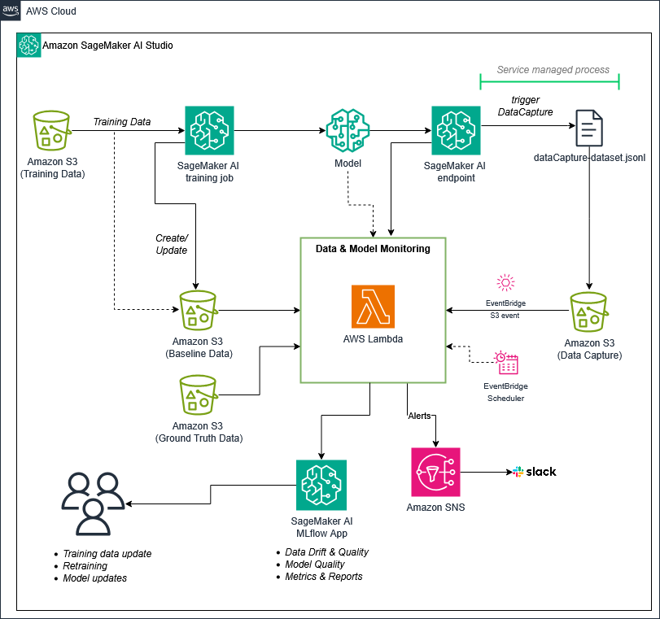

# Predictive ML Endpoint Monitoring with Evidently and Amazon SageMaker AI MLflow

Use open-source [Evidently](https://www.evidentlyai.com/evidently-oss) to detect data drift and measure model quality on inference data captured from an [Amazon SageMaker AI](https://docs.aws.amazon.com/sagemaker/latest/dg/whatis.html) real-time endpoint. All metrics and reports are logged to a serverless [SageMaker AI MLflow App](https://docs.aws.amazon.com/sagemaker/latest/dg/mlflow.html).

## Architecture



1. Train an XGBoost binary-classification model with [ModelTrainer](https://sagemaker.readthedocs.io/en/stable/#training-with-modeltrainer). The training features are saved to S3 as the baseline dataset.
2. Deploy the model to a SageMaker real-time endpoint with [data capture](https://docs.aws.amazon.com/sagemaker/latest/dg/model-monitor-data-capture.html) enabled. Every request/response pair is written to S3 automatically.
3. To calculate model quality, collect ground truth data when possible.
4. Run Evidently reports in AWS Lambda functions against the baseline and captured data to calculate data drift, and against the ground truth and captured data to calculate model quality.
5. Log the Evidently HTML reports and numeric metrics to MLflow for tracking and comparison.
6. (Optional) Publish an SNS alert when a model quality metric drops below a configurable threshold.

The notebook walks through steps 1–5 interactively. The CDK project (in `cdk/`) packages steps 3–5 into two Lambda functions so you can run them at scale on a schedule or in response to S3 events.

## Dataset

[Bank Marketing](https://archive.ics.uci.edu/dataset/222/bank+marketing) from the UCI Machine Learning Repository. The goal is to predict whether a customer will subscribe to a term deposit. The notebook downloads the dataset automatically.

## Repository Structure

```
├── ml_experimentation_with_data_model_monitoring_evidently_realtime.ipynb  # Main notebook
├── scripts/
│   ├── train.py                # XGBoost training script (runs inside a SageMaker training job)
│   └── requirements.txt        # Training job dependencies
├── inference_code/
│   └── inference.py            # Custom model loading for the SageMaker endpoint
├── data/                       # Generated locally by the notebook (train/val/test/baseline splits)
├── reports/                    # Generated locally by the notebook (Evidently HTML & JSON reports)
├── images/                     # Architecture diagram
└── cdk/                        # AWS CDK project for production Lambda deployment
    ├── bin/                    # CDK app entry point
    ├── lib/                    # CDK stack definition
    ├── lambda/                 # Lambda function source & Dockerfile
    │   ├── lambda_data_drift.py
    │   ├── lambda_model_quality.py
    │   ├── requirements.txt
    │   └── Dockerfile
    └── scripts/
        └── deploy.sh           # One-command deploy helper
```

## Prerequisites

- An AWS account with a SageMaker AI Studio domain or a SageMaker notebook instance
- A SageMaker execution role with permissions for S3, SageMaker, and MLflow
- An [MLflow App](https://docs.aws.amazon.com/sagemaker/latest/dg/mlflow-create-tracking-server-studio.html) (the notebook will guide you through finding or creating one)
- Python 3.10+

The notebook installs all Python dependencies (`sagemaker`, `mlflow`, `evidently`, `xgboost`, `scikit-learn`, `pandas`) in its first cell.

## Getting Started — Notebook

### 1. Open the notebook

Open `ml_experimentation_with_data_model_monitoring_evidently_realtime.ipynb` in SageMaker Studio (or any Jupyter environment with AWS credentials).

### 2. Configure your MLflow app

In the MLflow configuration section (Section 2), set `mlflow_app_name` to the name of your SageMaker AI MLflow App. The notebook will resolve the ARN and create an experiment automatically.

### 3. Run the notebook end-to-end

The notebook is organized into sequential sections:

| Section | What it does |
|---|---|
| 1 — Prerequisites & Setup | Installs packages, configures AWS session |
| 2 — MLflow App Configuration | Connects to your SageMaker AI MLflow App |
| 3 — Data Preparation | Downloads the Bank Marketing dataset, encodes features, splits into train/validation/test, uploads to S3 |
| 4 — Model Training | Trains an XGBoost model via SageMaker ModelTrainer with MLflow autologging |
| 5 — Real-Time Endpoint | Deploys the model to a SageMaker endpoint with data capture enabled |
| 6 — Data Drift Monitoring | Runs Evidently `DataDriftPreset` and `DataSummaryPreset` reports, logs drift metrics to MLflow |
| 7 — Model Quality Evaluation | Runs Evidently `ClassificationPreset` report, logs classification metrics to MLflow, sends SNS alert if thresholds are breached |
| 8 — Comprehensive Report (Optional) | Creates a combined drift + data quality report |
| 9 — Scaling with Lambda (Optional) | Prints CDK deploy commands, provides cells to invoke the deployed Lambda functions |
| 10 — Summary and Next Steps | Recap of what was accomplished and suggestions for further work |
| 11 — Cleanup (Optional) | Deletes the endpoint, MLflow experiment, and S3 data (cells are commented out for safety) |

After running the notebook you will have:
- A trained XGBoost model registered in MLflow
- A live SageMaker endpoint with data capture
- Evidently drift and model quality reports in the `reports/` directory and in MLflow
- Baseline data and ground truth files in S3 (needed for the CDK Lambda deployment)

> **Note:** The notebook injects artificial drift into the test data to demonstrate Evidently's detection capabilities. This is intentional and not representative of a production data distribution.

## Scaling through CDK Lambda Deployment

The `cdk/` directory packages the Evidently monitoring logic into two Docker-based Lambda functions so you can run drift and model quality checks automatically without re-running the notebook.

```
S3 (data capture) ──► EventBridge ──► lambda_data_drift    ──► MLflow
S3 (ground truth) ──► EventBridge ──► lambda_model_quality ──► MLflow + SNS (optional)
```

### Additional Prerequisites

- [Node.js 18+](https://nodejs.org/)
- [AWS CDK CLI](https://docs.aws.amazon.com/cdk/v2/guide/getting_started.html): `npm install -g aws-cdk`
- [Docker](https://docs.docker.com/get-docker/) running locally (the Lambda functions are deployed as container images)
- AWS credentials configured (`aws configure` or environment variables)

### 1. Run the notebook

Run through sections 1-8 of the notebook. This helps you set up all the components required for the CDK stack, including the endpoint, the MLflow app, and more. In section 9 of the notebook, run the first code cell to fetch all required variables at once.

### 2. Install CDK dependencies

```bash
cd cdk
npm install
```

### 3. Deploy

```bash
cd cdk

export ENDPOINT_NAME=<your-endpoint-name>
export BUCKET=<your-sagemaker-bucket>
export PREFIX=bank-marketing-monitoring
export BASELINE_KEY=${PREFIX}/data/baseline/baseline.csv
export CAPTURE_PREFIX=${PREFIX}/data-capture/${ENDPOINT_NAME}/AllTraffic
export GROUND_TRUTH_KEY=${PREFIX}/data/ground_truth/ground_truth.csv
export MLFLOW_TRACKING_URI=<your-mlflow-app-arn>
export MLFLOW_EXPERIMENT=<your-experiment-name>
export FEATURE_COLUMNS=<comma-separated-feature-column-names>

# Optional: enable SNS alerting for model quality degradation
# export SNS_TOPIC_ARN=<your-sns-topic-arn>

bash scripts/deploy.sh
```

The deploy script runs `cdk bootstrap` automatically (idempotent, safe to re-run). First deployment takes ~5–10 minutes while the container images are built and pushed to ECR.

### 4. Enable S3 EventBridge notifications

Enable EventBridge notifications on your S3 bucket so new data capture files can trigger the Lambda functions:

```bash
aws s3api put-bucket-notification-configuration \
  --bucket <your-sagemaker-bucket> \
  --notification-configuration '{"EventBridgeConfiguration": {}}'
```

Then create [S3 triggers for each Lambda](https://docs.aws.amazon.com/lambda/latest/dg/with-s3-example.html)

- **Data drift** — trigger on `s3:ObjectCreated:*` under `${PREFIX}/data-capture/`
- **Model quality** — trigger on `s3:ObjectCreated:*` under `${PREFIX}/data/ground_truth/`

### Model Quality Alerting

The model quality Lambda compares metrics against configurable thresholds (defaults shown):

| Metric | Default Threshold |
|---|---|
| F1 Score | 0.70 |
| Accuracy | 0.80 |
| ROC AUC | 0.75 |

If any metric falls below its threshold and `SNS_TOPIC_ARN` is set, the Lambda publishes an alert to the SNS topic. You can override thresholds by setting `THRESHOLD_F1`, `THRESHOLD_ACCURACY`, or `THRESHOLD_ROC_AUC` environment variables in the CDK stack.

## IAM Permissions

The SageMaker execution role (or local credentials) used to run `cdk deploy` needs:

- `iam:CreateRole`, `iam:AttachRolePolicy`, `iam:PutRolePolicy`, `iam:PassRole`
- `lambda:CreateFunction`, `lambda:UpdateFunctionCode`, `lambda:UpdateFunctionConfiguration`
- `cloudformation:*` (scoped to the stack)
- `ecr:CreateRepository`, `ecr:GetAuthorizationToken`, and ECR push permissions

The Lambda execution role created by the stack is granted:

- `s3:GetObject` and `s3:ListBucket` on the data bucket (under the configured prefix)
- `s3:GetObject`, `s3:PutObject`, and `s3:ListBucket` on the `mlflow/*` prefix (for MLflow artifact storage)
- `sagemaker:DescribeMlflowApp`, `sagemaker:CallMlflowAppApi`, and `sagemaker:CreatePresignedMlflowTrackingServerUrl` on the MLflow app
- `sns:Publish` on the SNS topic (if configured)

## Cleanup

Delete the CDK stack:

```bash
cd cdk
cdk destroy
```

Delete notebook resources (endpoint, MLflow experiment, S3 data) using the cleanup cells at the end of the notebook (Section 11).