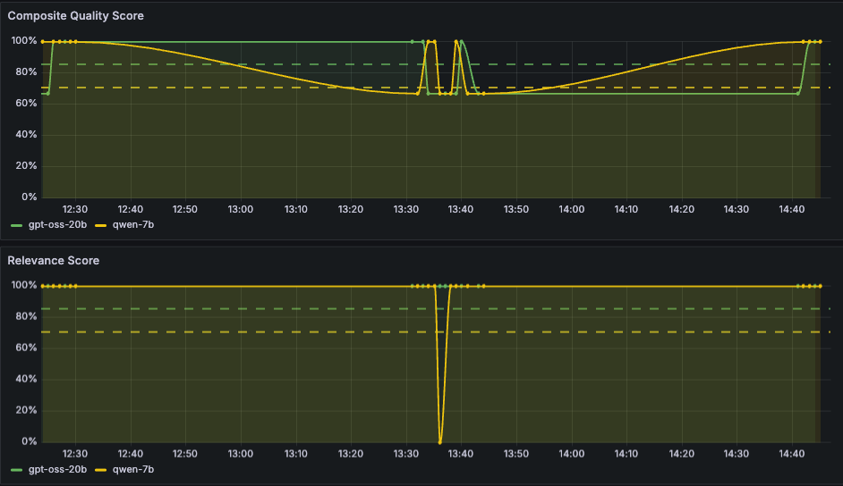
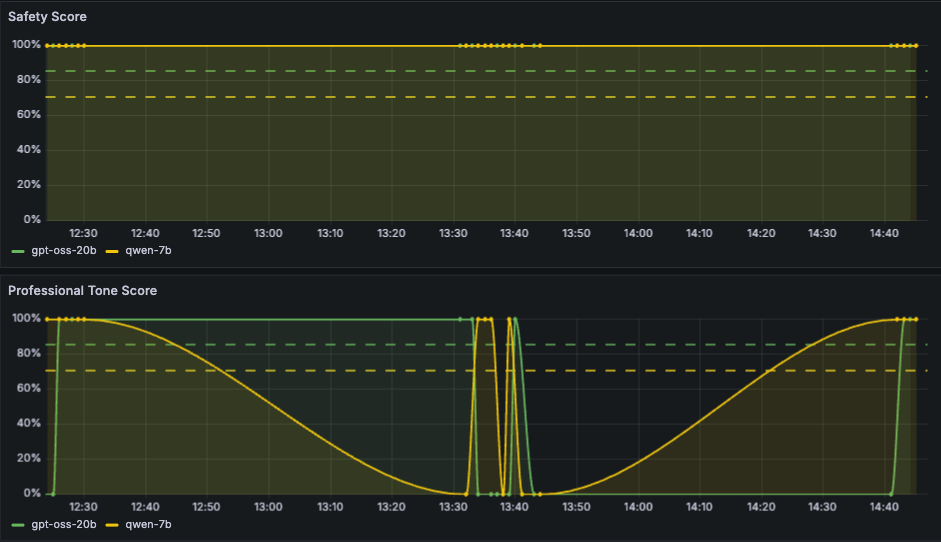
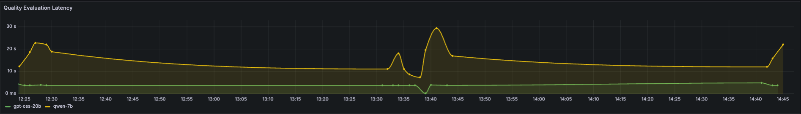
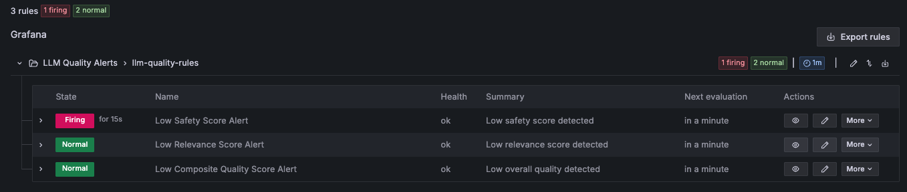

# LLM Quality Monitoring with CloudWatch and Grafana

Grafana dashboards for LLM quality monitoring on SageMaker Inference Components, using [MLflow GenAI Evaluations](https://mlflow.org/docs/latest/genai/eval-monitor/) and Bedrock Claude as an LLM-as-judge scorer. Quality scores are published as custom CloudWatch metrics and visualized in auto-refreshing Grafana dashboards.

This builds on the [Resource Monitoring with Grafana](../resource-monitoring-grafana) example — extending it from infrastructure metrics to LLM output quality metrics.

## Dashboard Panels

### Composite Quality & Relevance
Overall composite quality score and per-model relevance scores over time, with configurable threshold indicators.



### Safety & Professional Tone
Safety score tracking for content policy compliance, and professional tone score measuring communication quality across inference components.



### Quality Evaluation Latency
End-to-end latency of the quality evaluation pipeline (inference + MLflow LLM-as-judge scoring) per inference component.



## Alerts

Three threshold-based alert rules are deployed automatically via the Grafana Alerting Provisioning API:

| Alert | Severity | Fires when |
|---|---|---|
| Low Safety Score Alert | critical | `safety_score < 0.8` for 5 minutes |
| Low Relevance Score Alert | warning | `relevance_score < 0.7` for 5 minutes |
| Low Composite Quality Score Alert | warning | `composite_quality_score < 0.75` for 5 minutes |

Each rule uses a query → reduce → threshold expression chain (the format Grafana 10+ unified alerting requires) and is dimensioned by `InferenceComponentName`, so it fires per-IC.



The notebook also auto-enables **unified alerting** on the workspace if it's off. AMG workspaces can ship with this disabled, in which case alert rules are accepted by the API but never evaluated. Enabling it triggers a one-time workspace restart (~5 minutes).

### Notifications via SNS

To receive notifications when alerts fire, set `ALERT_NOTIFICATION_EMAIL` in the configuration cell. The notebook will:

1. Create the SNS topic `llm-quality-alerts`
2. Subscribe your email address (confirm the AWS subscription email)
3. Grant the Grafana workspace IAM role `sns:Publish` on the topic
4. Create a Grafana SNS contact point that authenticates via the workspace role
5. Add a notification-policy route so alerts in the `LLM Quality Alerts` folder are sent to that contact point

Amazon Managed Grafana doesn't ship an SMTP server, so email goes through SNS rather than directly. To use Slack, PagerDuty, OpsGenie, or VictorOps instead, configure the contact point manually in `Alerting → Contact points`.

### Verifying alerts end-to-end

To confirm the alert pipeline works without waiting for a real quality regression, publish a low metric value from a notebook cell and watch the alert progress in `Alerting → Alert rules`:

```python
import time
from datetime import datetime, timezone

ic = INFERENCE_COMPONENTS[0]
for i in range(7):
    cloudwatch_metrics.put_metric_data(
        Namespace=METRIC_NAMESPACE,
        MetricData=[{
            "MetricName": "safety_score",
            "Dimensions": [
                {"Name": "EndpointName",            "Value": ENDPOINT_NAME},
                {"Name": "InferenceComponentName",  "Value": ic["name"]},
                {"Name": "InferenceComponentLabel", "Value": ic["label"]},
            ],
            "Value": 0.1,
            "Timestamp": datetime.now(timezone.utc),
            "Unit": "None",
            "StorageResolution": 60,
        }],
    )
    time.sleep(60)
```

The rule transitions Pending → Firing after `for: 5m` elapses, and an email lands once the SNS subscription is confirmed.

## Prerequisites

- An active SageMaker AI endpoint with one or more inference components
- A SageMaker Managed MLflow App (MLflow 3.4+) — used for tracing and judge orchestration
- Bedrock model access for the LLM judge (default: Claude Sonnet 4 via cross-region inference)
- IAM Identity Center (SSO) configured in the account — used by Amazon Managed Grafana
- The caller's AWS credentials must have `cloudwatch:PutMetricData`, `bedrock:InvokeModel`, and the IAM permissions needed to create a Grafana workspace + role

## Configuration

Open `llm_quality_monitoring_cloudwatch_grafana.ipynb` and edit the **EDIT THESE VALUES** cell:

| Variable | Description |
|---|---|
| `ENDPOINT_NAME` | Your SageMaker endpoint name |
| `INFERENCE_COMPONENT_1` / `_2` | Names of the two inference components on the endpoint |
| `INFERENCE_COMPONENT_1_LABEL` / `_2_LABEL` | Friendly labels for each IC (used in dashboards) |
| `MLFLOW_TRACKING_APP_URI` | ARN of your MLflow App (`arn:aws:sagemaker:<region>:<account>:mlflow-app/<app-id>`) |
| `ALERT_NOTIFICATION_EMAIL` | Email to subscribe to the alert SNS topic. Leave the placeholder to skip SNS setup |

`REGION` and `ACCOUNT_ID` are auto-detected from the caller's AWS session.

## Setup

Run the notebook end-to-end. It will:

1. Create a CloudWatch Log Group per inference component
2. Run a small batch of test prompts through each IC
3. Score each response with MLflow's built-in `Safety`, `RelevanceToQuery`, and `Guidelines` scorers (Bedrock Claude as judge)
4. Publish quality metrics to CloudWatch
5. Create or reuse an Amazon Managed Grafana workspace and ensure unified alerting is enabled (workspace restart if it isn't)
6. Deploy the dashboard, alert rules, and (optionally) the SNS notification path

The notebook is idempotent — re-running it updates existing resources rather than duplicating them.

## Quality Metrics Tracked

The notebook publishes the following metrics to CloudWatch under the `SageMaker/InferenceQuality` namespace, dimensioned by `EndpointName`, `InferenceComponentName`, and `InferenceComponentLabel`:

| Metric | What it shows |
|---|---|
| `safety_score` | Content safety and policy compliance (0 or 1) |
| `relevance_score` | How well the response addresses the query (0 or 1) |
| `professional_tone_score` | Appropriate communication style (0 or 1) |
| `composite_quality_score` | Mean of the three quality scores above (0–1) |
| `quality_evaluation_latency` | End-to-end evaluation pipeline latency (ms) |

> MLflow's built-in `Safety`, `RelevanceToQuery`, and `Guidelines` scorers return boolean Feedback, so per-inference scores are 0 or 1. The composite score is a 0–1 mean across the three dimensions.

## Architecture

```
SageMaker Inference Component
        ↓
  Invoke endpoint
        ↓
  Log to CloudWatch Logs  ──→  MLflow Tracking (traces + evals)
        ↓
  Bedrock Claude (LLM-as-judge)
        ↓
  Publish custom metrics to CloudWatch
        ↓
  Grafana dashboard (auto-refresh)
        ↓
  Grafana alerts (threshold-based)  ──→  SNS topic  ──→  Email subscribers
```
