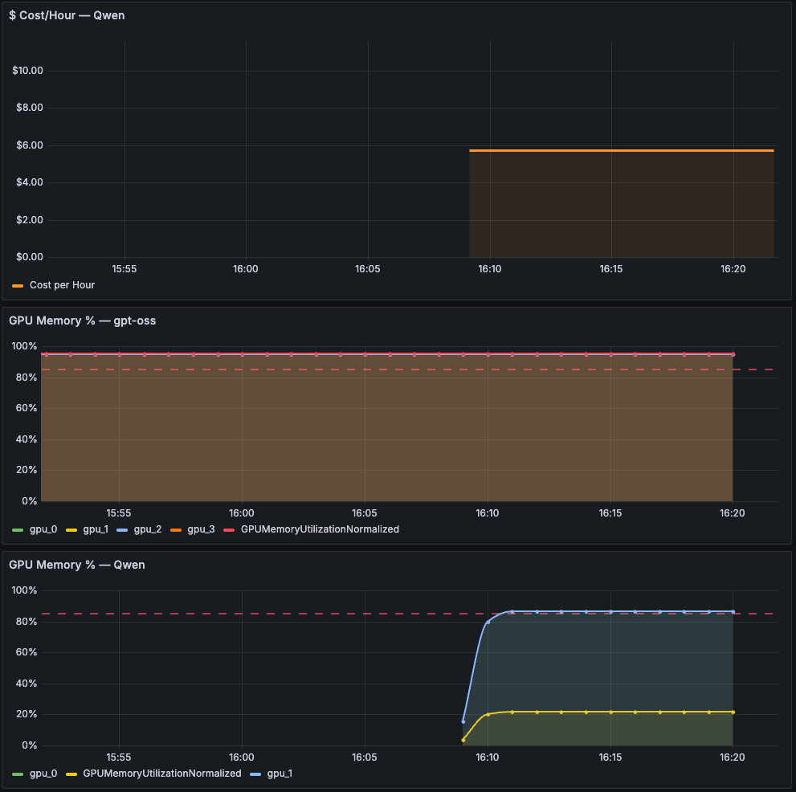
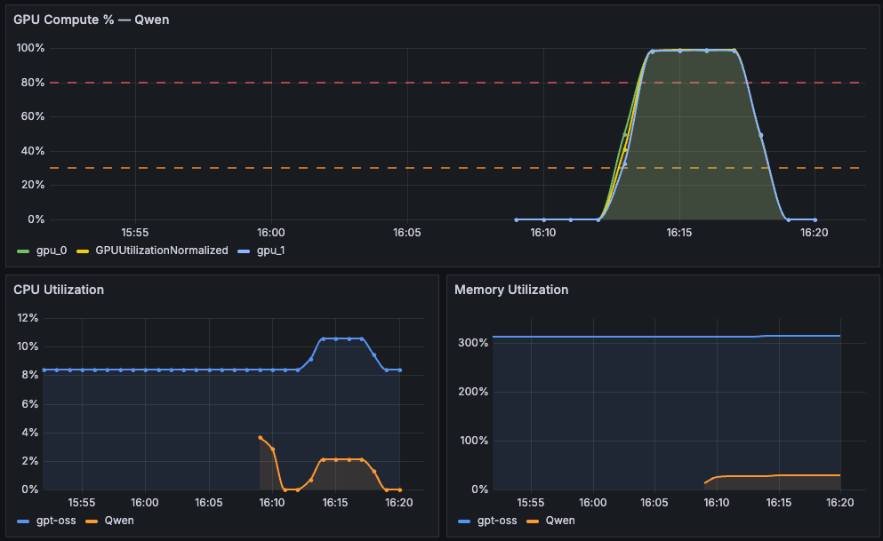
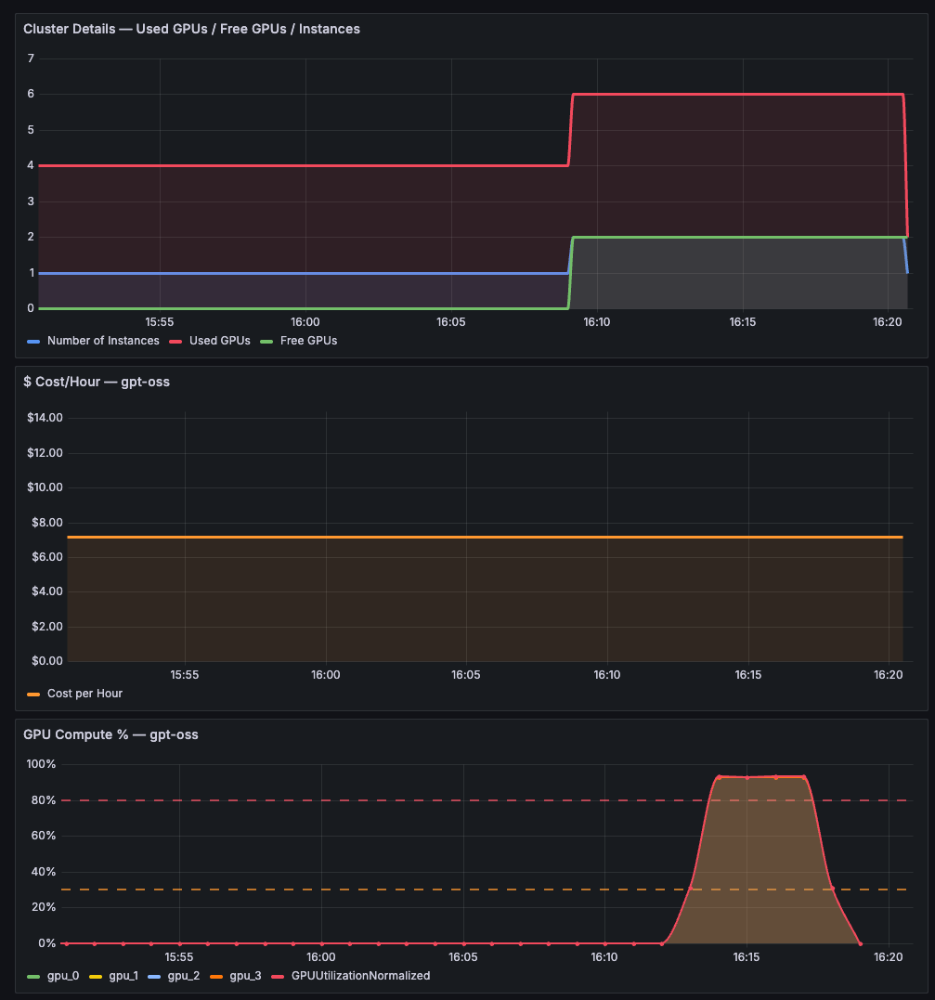

# SageMaker Endpoint Monitoring with Amazon Managed Grafana

Grafana dashboards for SageMaker inference endpoints, built on the [Enhanced Container Metrics](https://docs.aws.amazon.com/sagemaker/latest/dg/inference-enhanced-metrics.html) recently released for SageMaker AI. These metrics provide per-GPU, per-container, and per-inference-component observability at 10-second granularity.

This builds on the [Enhanced Metrics Notebook](https://github.com/aws-samples/sagemaker-genai-hosting-examples/blob/main/03-features/observability/enhanced-metrics-notebook.ipynb) which demonstrates collecting these metrics via CloudWatch APIs and matplotlib — here we replicate the same visualizations in a persistent, auto-refreshing Grafana dashboard.

## Dashboard Panels

### Cost Attribution & GPU Memory
Per-model hourly cost based on GPU allocation, and per-GPU memory utilization by inference component.

### GPU Compute, CPU & Memory Utilization
Per-GPU compute utilization with threshold indicators, plus CPU and memory comparison across inference components.

### Cluster Overview & Cost
Used vs free GPU inventory, per-model cost/hour, and GPU compute utilization across the endpoint.

## Setup

Run [`grafana_sagemaker_dashboard.ipynb`](grafana_sagemaker_dashboard.ipynb) — it creates the Grafana workspace, IAM role, data source, and deploys all panels programmatically. Requires an active SageMaker endpoint with inference components and IAM Identity Center (SSO).

## Key Metrics Used

| Metric | Namespace | What it shows |
|---|---|---|
| `GPUUtilizationNormalized` | `/aws/sagemaker/InferenceComponents` | Per-GPU compute % |
| `GPUMemoryUtilizationNormalized` | `/aws/sagemaker/InferenceComponents` | Per-GPU memory % |
| `CPUUtilizationNormalized` | `/aws/sagemaker/Endpoints` | Instance count (via SampleCount) |
| `ModelLatency` | `AWS/SageMaker` | Inference latency per IC |
| `Invocations` | `AWS/SageMaker` | Request count per IC and per container |
