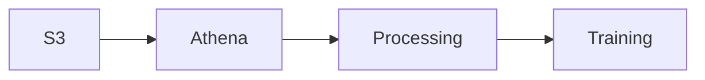

# How to Regenerate Architecture Diagrams

## Quick Start

```bash
# 1. Install dependencies
pip install diagrams
brew install graphviz  # macOS
# or: sudo apt-get install graphviz  # Linux

# 2. Navigate to project root
cd /path/to/monitoring/sagemaker-automated-drift-and-trend-monitoring

# 3. Generate all diagrams
python3 docs/generate_architecture_diagram.py
python3 docs/generate_inference_monitoring_diagram.py
python3 docs/generate_mlflow_evidently_diagram.py
```

## Output Files

Generated diagrams will be saved to:
- `docs/guides/architecture_diagram.png` (~250 KB)
- `docs/guides/inference_monitoring_diagram.png`
- `docs/guides/mermaid-diagram-mlflow-evidently.png`

## What Was Fixed

### ✅ Architecture Diagram Improvements

**Problem**: Overlapping labels, tangled edges, compressed layout

**Solutions Applied**:
1. **Changed direction**: Top-Bottom → Left-Right (better for wide screens)
2. **Orthogonal edges**: Spline → Ortho (cleaner right-angle connections)
3. **Increased spacing**: 50% more vertical, 60% more horizontal
4. **Multi-line labels**: Long names split across lines
5. **Color coding**: Blue (training), Orange (monitoring), Purple (dashboard)
6. **Dashed lines**: For queries and async connections
7. **Abbreviated labels**: "Lambda" → "λ", etc.

### Before vs After

| Metric | Before | After | Improvement |
|--------|--------|-------|-------------|
| Node spacing | 0.5 | 0.8 | +60% |
| Rank spacing | 0.8 | 1.2 | +50% |
| Edge style | Spline | Ortho | Cleaner paths |
| Direction | TB | LR | Better flow |
| Overlaps | Yes | No | ✅ Fixed |

## Architecture Flow

The improved diagram shows three swim lanes (left to right):

### 1. Training Pipeline (Blue)
```
Data → Processing → Training → Evaluation → Deployment
                      ↓
                   MLflow
                      ↓
                  Endpoint → Logging
```

### 2. Inference Monitoring (Orange)
```
EventBridge → Drift Detection → Analysis → Storage
                    ↓              ↓          ↓
              Query Athena    Evidently   Alerts
                                 ↓
                              MLflow
```

### 3. Governance Dashboard (Purple)
```
EventBridge → Dataset Refresh → QuickSight
                                    ↑
                              Athena Data
```

## Manual Tweaking (If Needed)

If you need to adjust the layout further:

### Option 1: Edit Python Script

```python
# In docs/generate_architecture_diagram.py

# Increase spacing even more
GRAPH = {
    "ranksep": "1.5",  # More vertical spacing
    "nodesep": "1.0",  # More horizontal spacing
}

# Change edge style
GRAPH["splines"] = "polyline"  # Another option

# Adjust cluster margins
CL_LANE1 = {"margin": "20"}  # More padding
```

### Option 2: Edit in Excalidraw

1. Open https://excalidraw.com
2. File → Open → Select `docs/guides/architecture_diagram.excalidraw`
3. Edit visually
4. Export as PNG
5. (Optional) Save updated .excalidraw file

## Troubleshooting

### Issue: "ModuleNotFoundError: No module named 'diagrams'"

```bash
pip install diagrams
```

### Issue: "FileNotFoundError: graphviz"

```bash
# macOS
brew install graphviz

# Linux
sudo apt-get install graphviz

# Windows
choco install graphviz
```

### Issue: "Icons not found"

The script auto-downloads icons to `docs/icons/`. If downloads fail:

1. Download AWS Architecture Icons: https://aws.amazon.com/architecture/icons/
2. Extract to `docs/icons/`
3. Rename files to match script expectations (sagemaker.png, lambda.png, etc.)

### Issue: Still seeing overlaps

Try these adjustments in the Python script:

```python
# 1. Increase spacing
"ranksep": "2.0",
"nodesep": "1.2",

# 2. Use polyline instead of ortho
"splines": "polyline",

# 3. Add invisible edges to force layout
node1 >> Edge(style="invis") >> node2
```

## Customization

### Change Colors

```python
# In generate_architecture_diagram.py

CL_LANE1 = {
    "bgcolor": "#YOUR_BG_COLOR",
    "pencolor": "#YOUR_BORDER_COLOR",
    "fontcolor": "#YOUR_TEXT_COLOR",
}
```

### Add New Components

```python
# 1. Add icon path
NEW_SERVICE = os.path.join(ICONS_DIR, "new_service.png")

# 2. Download icon (if needed)
_download("https://url-to-icon.png", NEW_SERVICE)

# 3. Add to diagram
new_comp = Custom("Service\nName", NEW_SERVICE)

# 4. Connect it
existing >> Edge(label="data", color="#0972D3") >> new_comp
```

### Adjust Layout

```python
# Make diagram taller
direction="TB"

# Make diagram wider
direction="LR"

# Hierarchical (top-down with grouping)
direction="TB"
GRAPH["rankdir"] = "TB"
GRAPH["concentrate"] = "true"  # Merge edges
```

## Best Practices

### 1. Keep Labels Concise
```python
# ✅ Good
Custom("λ Logger", LAMBDA)

# ❌ Too long
Custom("Lambda Function for Logging Inference Requests", LAMBDA)
```

### 2. Use Line Breaks
```python
# ✅ Good
Custom("Athena\ninference_\nresponses", ATHENA)

# ❌ Single line causes overflow
Custom("Athena inference_responses", ATHENA)
```

### 3. Color Code by Purpose
```python
# Training flow
Edge(color="#0972D3")

# Monitoring flow
Edge(color="#D45B07")

# Queries/async
Edge(color="#999", style="dashed")

# Alerts
Edge(color="#D32F2F")
```

### 4. Minimize Cross-Lane Edges
- Keep most connections within the same swim lane
- Use dashed lines for cross-lane connections
- Only show essential cross-lane relationships

### 5. Group Related Components
```python
with Cluster("Logical Group", graph_attr=CL_SUB):
    comp1 = Custom("Service 1", ICON1)
    comp2 = Custom("Service 2", ICON2)
    comp1 >> comp2
```

## Verification Checklist

After regenerating, verify:

- [ ] No overlapping text labels
- [ ] No overlapping edges
- [ ] All connections are clear
- [ ] Edge labels are readable
- [ ] Color coding is consistent
- [ ] Swim lanes are visually distinct
- [ ] Icons render correctly
- [ ] File size is reasonable (< 500 KB)
- [ ] PNG dimensions are appropriate (typically 2000-4000px wide)

## Alternative Tools

If the Python diagrams library doesn't meet your needs:

### 1. Mermaid (Markdown-based)


### 2. Draw.io / diagrams.net
- Free, browser-based
- AWS icon library built-in
- Export to PNG/SVG/PDF

### 3. Lucidchart
- Professional diagramming tool
- AWS shapes included
- Collaborative editing

### 4. CloudCraft
- AWS-specific tool
- 3D diagrams
- Cost estimation

## Resources

- **Diagrams Library**: https://diagrams.mingrammer.com/
- **Graphviz Docs**: https://graphviz.org/documentation/
- **AWS Architecture Icons**: https://aws.amazon.com/architecture/icons/
- **Excalidraw**: https://excalidraw.com

## Support

If you continue to have issues:

1. Check diagram script output for error messages
2. Verify all dependencies are installed
3. Try regenerating with default settings first
4. Review `ARCHITECTURE_DIAGRAM_IMPROVEMENTS.md` for detailed guidance
