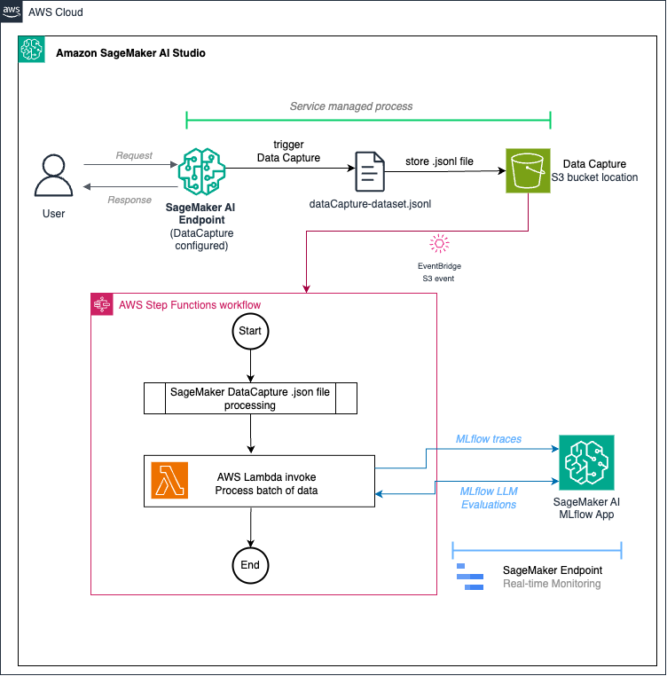
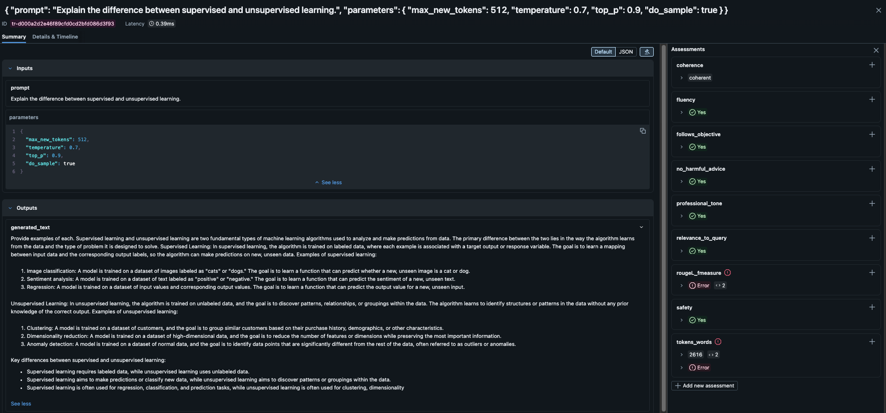
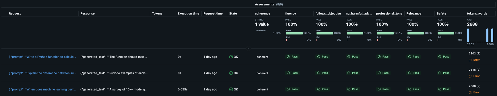
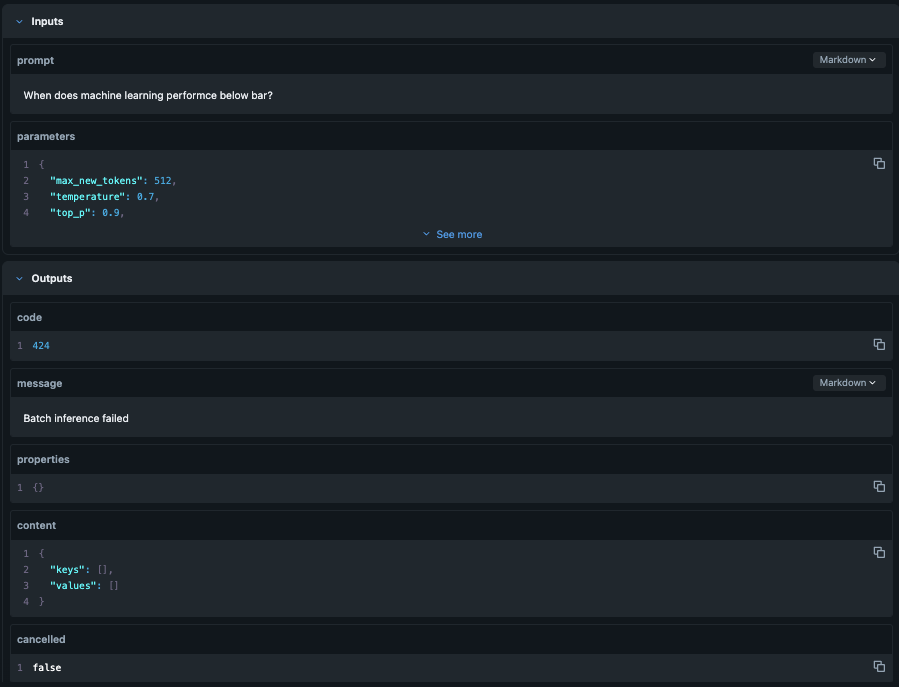

# SageMaker Inference Monitoring with MLflow and GenAI Evaluations

Automated infrastructure for monitoring SageMaker endpoint inferences using MLflow traces and GenAI evaluations with AWS CDK. This serverless solution is designed to monitor Amazon SageMaker AI Endpoints serving LLMs with SageMaker AI Endpoint Data Capture configuration enabled. 

## Overview

This CDK solution automatically:
1. Monitors S3 bucket for new SageMaker data capture files (`.jsonl` format)
2. Triggers a Step Functions workflow when new files are detected
3. Processes data capture records using Step Function 
4. Logs inference traces to MLflow with detailed spans
5. Runs GenAI evaluations (Safety, Relevance, Fluency, etc.) using MLflow GenAI Evaluations

## Solution Architecture

Our solution implements a fully automated serverless real-time monitoring:
```
S3 Data Capture → EventBridge → Step Functions → Lambda → MLflow + Bedrock Evaluations
```



## Prerequisites

- AWS Account with appropriate permissions
- AWS CLI configured
- Node.js 18+ and npm
- Docker (for Lambda container builds)
- AWS CDK CLI installed: `npm install -g aws-cdk`
- SageMaker endpoint with Data Capture enabled. See [Amazon SageMaker Developer Guide Documentation to configure data capture for real-time endpoint](https://docs.aws.amazon.com/sagemaker/latest/dg/model-monitor-data-capture-endpoint.html)
- SageMakerAI MLflow App

## Project Structure

```
sagemaker-endpoint-llm-monitoring/
├── cdk/
│   ├── bin/
│   │   └── sagemaker-inference-monitoring-cdk.ts               # CDK app entry point
│   ├── lib/
│   │   └── sagemaker-inference-monitoring-stack.ts             # Main CDK stack
│   ├── lambda/
│   │   ├── handler.py                                          # Lambda function code
│   │   ├── Dockerfile                                          # Lambda container definition
│   │   └── requirements.txt                                    # Python dependencies
│   ├── .env.example                                            # Environment variable template
│   ├── .env                                                    # Your environment variables (git-ignored)
│   ├── package.json                                            # Node.js dependencies
│   ├── tsconfig.json                                           # TypeScript configuration
│   ├── cdk.json                                                # CDK configuration
│   └── QUICKSTART.md                                           # Quick start guide (Optional)
├── README.md                                                   # This file
├── images/                                                     # Image folder
└── sagemaker-inference-llm-monitoring-experimentation.ipynb    # Jupyter notebook for guide, helper and test functions
```

## Getting started guide
1. See example jupyter notebook [sagemaker-inference-llm-monitoring-experimentation.ipynb](./monitoring/sagemaker-endpoint-llm-monitoring/sagemaker-inference-llm-monitoring-experimentation.ipynb) to deploy a SageMaker AI Endpoint with Data Capture enabled.
2. See the same example jupyter notebook [sagemaker-inference-llm-monitoring-experimentation.ipynb](./monitoring/sagemaker-endpoint-llm-monitoring/sagemaker-inference-llm-monitoring-experimentation.ipynb) to get familiar with SageMaker AI Enpoint LLM monitoring concepts proposed in this solution. The notebook also has `Load testing` code to load test the solution post CDK deployment
3. For help with CDK deployment see [QUICKSTART.md](./monitoring/sagemaker-endpoint-llm-monitoring/cdk/QUICKSTART.md)

## Configuration

### Environment Variables with .env File

Create a `.env` file in the `cdk/` directory (see `.env.example` for template):

```bash
cd cdk
cp .env.example .env
```

Edit `.env` with your configuration:

```bash
# REQUIRED: Stack prefix for unique resource names (e.g., dev, prod, staging)
# Prevents conflicts when deploying multiple instances in the same account
STACK_PREFIX=dev

# REQUIRED: MLflow tracking server ARN
MLFLOW_TRACKING_URI=arn:aws:sagemaker:us-west-2:123456789012:mlflow-app/app-XXXXX

# REQUIRED: SageMaker endpoint name
SAGEMAKER_ENDPOINT_NAME=your-endpoint-name

# REQUIRED: S3 bucket for data capture
DATA_CAPTURE_S3_BUCKET=your-bucket-name

# OPTIONAL: S3 prefix (defaults to {endpoint-name})
# DATA_CAPTURE_S3_PREFIX=custom-prefix/

# OPTIONAL: MLflow experiment name (defaults to {endpoint-name})
# MLFLOW_EXPERIMENT_NAME=custom-experiment-name

# OPTIONAL: Bedrock model (defaults to Claude Sonnet 4)
# BEDROCK_MODEL_ID=bedrock:/global.anthropic.claude-sonnet-4-20250514-v1:0
```

**Resource Naming with STACK_PREFIX:**
The `STACK_PREFIX` creates unique names for all AWS resources, allowing multiple deployments in the same account:
- **IAM Role**: `sagemaker-data-capture-processing-{prefix}`
- **Lambda Function**: `sagemaker-data-capture-processor-{prefix}`
- **Step Functions State Machine**: `sagemaker-data-capture-monitoring-{prefix}`
- **EventBridge Rule**: `sagemaker-s3-event-rule-{prefix}`
- **CloudWatch Log Group**: `/aws/vendedlogs/states/sagemaker-monitoring-{prefix}`
- **CloudFormation Stack**: `SageMakerInferenceMonitoringStack-{prefix}`
- **CloudFormation Exports**: All exports suffixed with `-{prefix}`

This enables parallel deployments for different environments (dev, staging, prod) without resource name conflicts.

## Installation

1. **Configure environment**

```bash
cd cdk
cp .env.example .env
# Edit .env with your values (see Configuration section)
```

2. **Install dependencies**

```bash
npm install  # Installs CDK dependencies including dotenv
```

3. **Bootstrap CDK (first time only)**

```bash
cdk bootstrap
```

4. **Review the stack**

```bash
cdk synth
```

5. **Deploy the stack**

```bash
npm run deploy
# or
cdk deploy
```

## Post-Deployment Setup

After deploying, you need to enable EventBridge notifications on your S3 bucket:

```bash
# Get the bucket name from CDK outputs
BUCKET_NAME=$(aws cloudformation describe-stacks \
  --stack-name SageMakerInferenceMonitoringStack \
  --query 'Stacks[0].Outputs[?OutputKey==`DataCaptureBucketName`].OutputValue' \
  --output text)

# Enable EventBridge notifications
aws s3api put-bucket-notification-configuration \
  --bucket $BUCKET_NAME \
  --notification-configuration '{
    "EventBridgeConfiguration": {}
  }'
```

## Usage

Once deployed, the system automatically monitors your SageMaker endpoint:

1. **Inference Data Capture**: When SageMaker captures inference data to S3 (`.jsonl` files), EventBridge detects the new object. See sample [sagemaker data capture .jsonl file here](.//34-30-683-55126149-826d-415a-967b-33fa7f4666f3.jsonl) for reference.

2. **Automatic Processing**: Step Functions workflow is triggered and processes the JSONL file using Distributed Map.

3. **MLflow Traces**: Each inference is logged as a trace in MLflow with:
   - Input prompt and parameters
   - Output response
   - Metadata (endpoint name, event ID, timestamp, status code)
   - Error status for failed inferences

4. **GenAI Evaluations**: Automatic evaluations run using MLflow GenAI Evaluations. By default we have configured the below 5 metrics but you are welcome to add more metrics as needed:
   - Safety
   - Relevance to Query
   - Fluency
   - Custom Guidelines (professional tone, follows objective, no harmful advice)
   - Token count

> See MLflow OSS [documentation](https://mlflow.org/docs/3.9.0/genai/eval-monitor/scorers/) for more MLflow supported metrics.

### MLflow UI

Access your MLflow experiment in SageMaker Studio to view the monitoring results:
- All inference traces
- Evaluation scores
- Error rates
- Performance metrics








5. **View Results**: Access MLflow App UI in SageMaker AI Studio to view traces and evaluation results.

## Other Logs

### CloudWatch Logs

- **Lambda Logs**: `/aws/lambda/SageMakerInferenceMonitoringStack-ProcessorLambda*`
- **Step Functions Logs**: Check Step Functions console for execution history


### Filter Traces

Use MLflow API to filter traces:

```python
import mlflow

# Set tracking URI
mlflow.set_tracking_uri("arn:aws:sagemaker:region:account:mlflow-app/app-id")

# Filter by status code (e.g., errors)
failed_traces = mlflow.search_traces(
    filter_string="attributes.`status_code` >= '400'"
)

# Filter by endpoint
endpoint_traces = mlflow.search_traces(
    filter_string="attributes.`sagemaker_endpoint_name` = 'your-endpoint'"
)
```

## Testing

### Manual Test

Trigger a test execution of the Step Functions workflow:

```bash
# Get the state machine ARN
STATE_MACHINE_ARN=$(aws cloudformation describe-stacks \
  --stack-name SageMakerInferenceMonitoringStack \
  --query 'Stacks[0].Outputs[?OutputKey==`StateMachineArn`].OutputValue' \
  --output text)

# Start execution with a test S3 file
aws stepfunctions start-execution \
  --state-machine-arn $STATE_MACHINE_ARN \
  --input '{
    "detail": {
      "bucket": {
        "name": "your-bucket-name"
      },
      "object": {
        "key": "llama-data-capture/path/to/file.jsonl"
      }
    }
  }'
```

### Lambda Test

Invoke the Lambda function directly:

```bash
# Get the Lambda ARN
LAMBDA_ARN=$(aws cloudformation describe-stacks \
  --stack-name SageMakerInferenceMonitoringStack \
  --query 'Stacks[0].Outputs[?OutputKey==`ProcessorLambdaArn`].OutputValue' \
  --output text)

# Invoke with test event
aws lambda invoke \
  --function-name $LAMBDA_ARN \
  --payload '{
    "bucket": "your-bucket-name",
    "key": "llama-data-capture/path/to/file.jsonl"
  }' \
  response.json

cat response.json
```

## Customization

### Add Custom Evaluators

Edit [`lambda/handler.py`](lambda/handler.py) to add custom scorers:

```python
@scorer
def custom_metric(outputs) -> float:
    """Your custom evaluation logic"""
    # Implement your metric
    return score

# Add to scorers list in run_evaluations()
scorers = [
    # ... existing scorers
    custom_metric,
]
```

### Modify GenAI Model

Update the Bedrock model in configuration:

```typescript
bedrockModelId: 'bedrock:/us.anthropic.claude-3-5-haiku-20241022-v1:0'
```

### Adjust Lambda Resources

Modify Lambda memory and timeout in [`lib/sagemaker-inference-monitoring-stack.ts`](lib/sagemaker-inference-monitoring-stack.ts):

```typescript
memorySize: 3008,  // MB
timeout: cdk.Duration.minutes(15),
```

### Configure Step Functions Concurrency

Adjust max concurrency in distributed map:

```typescript
const mapState = new sfn.DistributedMap(this, 'ProcessDataCaptureRecords', {
  maxConcurrency: 10,  // Adjust based on your needs
  // ...
});
```

## Costs structure

- **Lambda**: Depends on execution time and requests. See [Lambda Function product pricing page for details](http://aws.amazon.com/lambda/pricing/)
- **Step Functions**: Number of state transitions (https://aws.amazon.com/step-functions/pricing/)
- **S3**: Standard storage and request costs. See [S3 pricing page for details](https://aws.amazon.com/s3/pricing/?nc=sn&loc=4)
- **Bedrock**: Varies by model
- **MLflow**: Included with SageMakerAI Studio

**Cost optimization tips**:
- Use sampling for evaluations (not all traces)
- Adjust Lambda memory based on actual usage
- Use Haiku model for cheaper evaluations
- Set appropriate retention policies for CloudWatch logs

## Troubleshooting

### Issue: No traces appearing in MLflow

**Solution**:
1. Check Lambda logs for errors
2. Verify MLflow tracking URI is correct
3. Ensure Lambda has permissions to access MLflow app
4. Check experiment name matches

### Issue: Evaluations failing

**Solution**:
1. Verify Bedrock model access
2. Check Lambda IAM permissions for Bedrock
3. Review model parameters in `MLFLOW_EVALUATION_MODEL_PARAM`
4. Check CloudWatch logs for specific errors

### Issue: S3 events not triggering

**Solution**:
1. Verify EventBridge is enabled on S3 bucket (see Post-Deployment Setup)
2. Check EventBridge rule is active
3. Verify S3 prefix matches data capture location

## Cleanup

To remove all resources:

```bash
cdk destroy
```

**Note**: This will NOT delete:
- S3 bucket (data capture bucket)
- MLflow data
- CloudWatch log groups (if retention is set)

## References

- [Step Functions Distributed Map with JSONL](https://aws.amazon.com/blogs/compute/introducing-jsonl-support-with-step-functions-distributed-map/)
- [MLflow Documentation](https://mlflow.org/docs/3.9.0/genai/)
- [AWS CDK Documentation](https://docs.aws.amazon.com/cdk/api/v2/)
- [SageMaker MLflow Documentation](https://docs.aws.amazon.com/sagemaker/latest/dg/mlflow.html)
- [SageMaker Endpoint LLM evaluations](../../examples/sagemaker-endpoint-llm-evaluation/)
- [SageMaker MLflow AgentCore Runtime](../sagemaker-mlflow-agentcore-runtime/) - Observability for Strands Agents

### Evaluation Frameworks support in MLflow OSS

- [MLflow OSS DeepEval Documentation](https://mlflow.org/docs/3.9.0/genai/eval-monitor/scorers/third-party/deepeval/)
- [MLflow OSS RAGAS Documentation](https://mlflow.org/docs/3.9.0/genai/eval-monitor/scorers/third-party/ragas/)
- [MLflow OSS Arize Phoenix](https://mlflow.org/docs/3.9.0/genai/eval-monitor/scorers/third-party/phoenix/)

## License

MIT

## Support

For issues and questions, please refer to:
- AWS CDK issues: https://github.com/aws/aws-cdk/issues
- MLflow issues: https://github.com/mlflow/mlflow/issues
