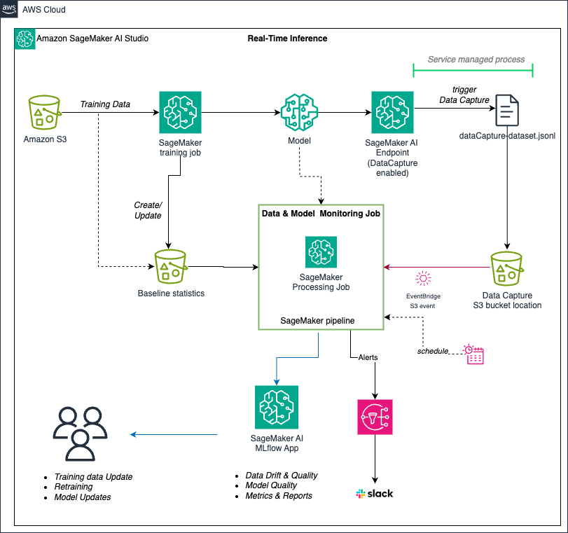
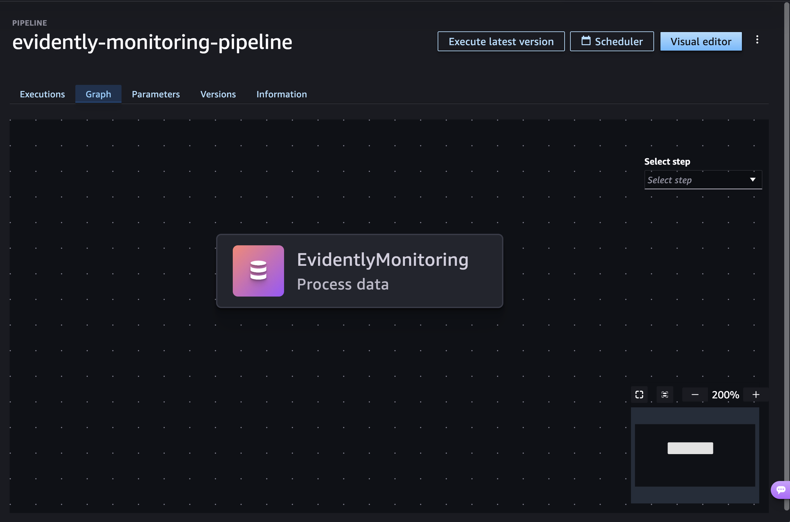
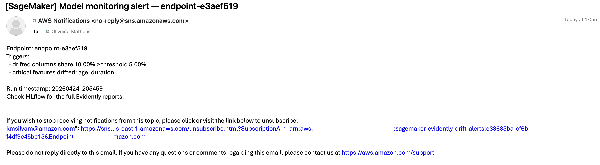

# Real-Time Inference Monitoring with Evidently AI and SNS Alerting

> **Referral README.** The complete walkthrough lives in the [amazon-sagemaker-from-idea-to-production](https://github.com/aws-samples/amazon-sagemaker-from-idea-to-production) workshop, specifically in **Section 8** of **[Notebook 06 – Monitoring with Evidently](https://github.com/aws-samples/amazon-sagemaker-from-idea-to-production/blob/master/06-monitoring-with-evidently.ipynb)**. This folder exists to give visibility to this real-time flavor of model monitoring, which complements the batch pattern already available in [`predictiveml-batch-monitoring-pipeline/`](../predictiveml-batch-monitoring-pipeline/).

## Overview

This flavor demonstrates **real-time inference endpoint monitoring** with **email alerting** via Amazon SNS — not the batch pattern. A SageMaker **real-time endpoint with Data Capture enabled** continuously writes request/response payloads to S3; a scheduled SageMaker Pipeline then uses [Evidently AI (open-source)](https://www.evidentlyai.com/evidently-oss) to compare the captured traffic against the training baseline, compute data drift (`DataDriftPreset`) and model quality (`ClassificationPreset`) reports, log everything to SageMaker Managed MLflow, and fire an SNS email alert whenever the share of drifted columns crosses a configurable threshold or a critical feature starts drifting. The whole loop is automated by **Amazon EventBridge Scheduler**, so drift checks run on a cadence without manual intervention.

Key building blocks:

- **Real-time endpoint with Data Capture** — request/response payloads written to `s3://.../<endpoint>/AllTraffic/<yyyy/mm/dd/hh>/`.
- **Evidently presets** — `DataDriftPreset` for data drift and `ClassificationPreset` for model quality, referenced against the training baseline.
- **SageMaker Pipeline `evidently-monitoring-pipeline`** — a single `FrameworkProcessor` Processing step (`EvidentlyMonitoring`) that pulls baseline and Data Capture data from S3 (scoped to the endpoint's `AllTraffic` prefix with a configurable `LookbackDays`) and runs the Evidently job.
- **Amazon EventBridge Scheduler** — triggers `StartPipelineExecution` on a cron expression you choose. Gated behind an `ENABLE_SCHEDULE` flag in the notebook so no schedule fires by surprise during learning.
- **SageMaker Managed MLflow** — drift metrics and the full Evidently HTML/JSON reports are logged so the alert recipient can jump straight to the artifacts via the `run_id` and experiment embedded in the message.
- **Amazon SNS email alert** — fired when `drifted_columns_share > DriftThreshold` (default `0.05`) or when any `CriticalFeatures` (default `duration,age`) drift. The message body includes the triggers, the list of drifted features, the endpoint name, the run timestamp, and the MLflow context.

## Architecture

1. Train the XGBoost model (workshop uses the UCI Bank Marketing dataset) and store the baseline dataset in S3.
2. Deploy the model to a real-time endpoint with Data Capture enabled.
3. The scheduled `EvidentlyMonitoring` Processing step reads the baseline + recently captured data and runs the Evidently presets.
4. Drift metrics and the full Evidently reports are logged to SageMaker Managed MLflow.
5. When triggers fire, an SNS notification is emailed to subscribed recipients, pointing back to MLflow for root-cause analysis.

## Sample Output

### SageMaker Pipeline execution

`evidently-monitoring-pipeline` runs the `EvidentlyMonitoring` Processing step, schedulable via the built-in **Scheduler** in SageMaker Studio:

### SNS email alert

Sample notification sent when drift crosses the configured threshold — the endpoint name, the triggers that fired, the critical features that drifted (`age`, `duration`), the run timestamp, and a pointer to the MLflow Evidently reports are all embedded in the body:

## When to Use This Flavor

Pick this flavor when you need:

- **Always-on real-time endpoint monitoring** (vs. periodic batch Transform predictions).
- **Low operational footprint** — a single Processing step + EventBridge schedule + SNS topic; no data lake or dashboard required.
- **Proactive email alerting** with critical-feature awareness and direct links to MLflow for triage.
- A **learning-friendly reference** that layers on top of the end-to-end SageMaker AI workshop.

For richer patterns, see the sibling solutions:

- [Predictive ML Batch Monitoring Pipeline](../predictiveml-batch-monitoring-pipeline/) — for periodic batch Transform workloads.
- [Real-Time Inference Monitoring with QuickSight dashboards](../sagemaker-automated-drift-and-trend-monitoring/) — for production setups with Athena data lake and governance dashboards.
- [LLM Inference Monitoring](../sagemaker-endpoint-llm-monitoring/) — for generative AI endpoints with MLflow GenAI evaluations.

## Getting Started

The full implementation (training, endpoint deployment with Data Capture, Evidently experimentation in Sections 1–7, and the automated pipeline + SNS alerting in **Section 8**) lives in:

**[06-monitoring-with-evidently.ipynb](https://github.com/aws-samples/amazon-sagemaker-from-idea-to-production/blob/master/06-monitoring-with-evidently.ipynb)** — inside the [amazon-sagemaker-from-idea-to-production](https://github.com/aws-samples/amazon-sagemaker-from-idea-to-production) workshop.

The Section 8 automation showcased here was contributed in [PR #34](https://github.com/aws-samples/amazon-sagemaker-from-idea-to-production/pull/34).

## License

This referral README is licensed under the MIT-0 License. See the repository-level LICENSE file.
